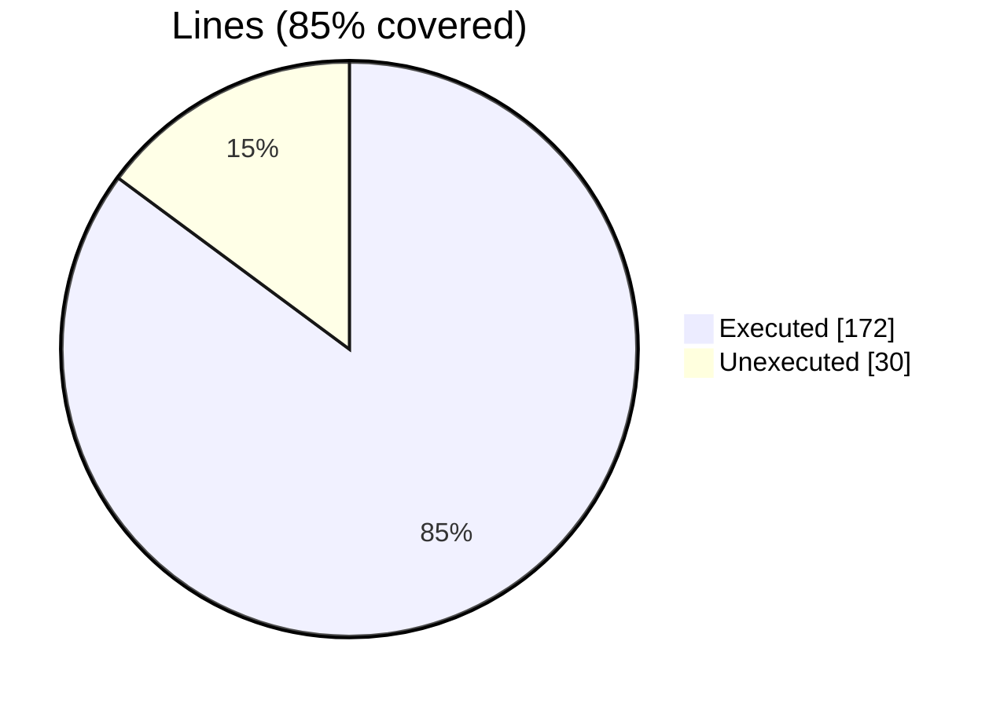
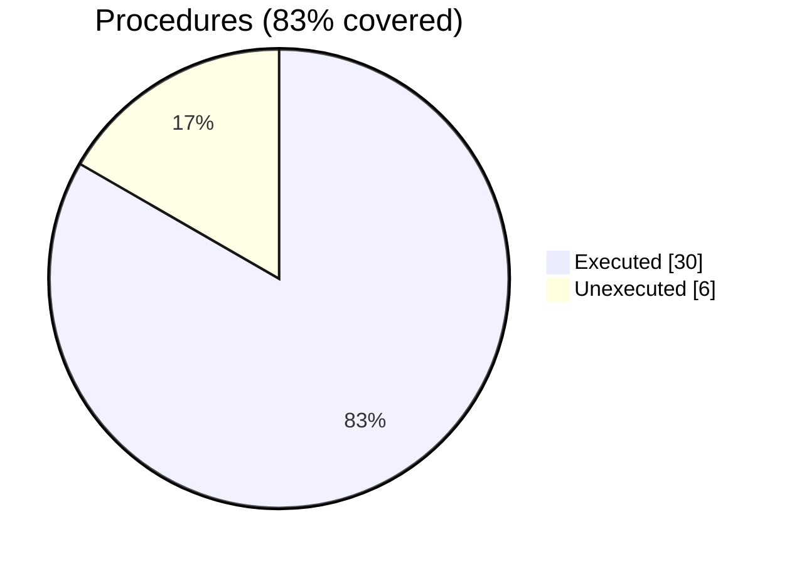

### Coverage analysis of *adam_fdv_operators_library.F90*

|Lines| | |
| --- | --- | --- |
|Executable lines            |202| |
|Executed lines              |172|85%|
|Unexecuted lines            |30|15%|
|Average hits / executed     |136900.0| |

|Procedures| | |
| --- | --- | --- |
|Total procedures            |36| |
|Executed procedures         |30|83%|
|Unexecuted procedures       |6|17%|
|Average hits / executed     |84536.66666666667| |

#### Unexecuted procedures

 + *subroutine* **compute_derivative5_fv_lupwind**, line 906
 + *subroutine* **compute_derivative5_fv_rupwind**, line 807
 + *subroutine* **compute_derivative6_fv_centered**, line 682
 + *subroutine* **compute_derivative6_fv_lupwind**, line 920
 + *subroutine* **compute_derivative6_fv_rupwind**, line 821
 + *subroutine* **compute_reconstruction_r_fd_centered**, line 435

#### Executed procedures

 + *subroutine* **compute_reconstruction_r_fv_centered**: tested **1068400** times
 + *subroutine* **compute_derivative1_fv_centered**: tested **534200** times
 + *subroutine* **compute_derivative1_fd_centered**: tested **481000** times
 + *subroutine* **compute_derivative2_fd_centered**: tested **120500** times
 + *subroutine* **compute_curl_fd_centered**: tested **40000** times
 + *subroutine* **compute_divergence_fd_centered**: tested **40000** times
 + *subroutine* **compute_gradient_fd_centered**: tested **40000** times
 + *subroutine* **compute_laplacian_fd_centered**: tested **40000** times
 + *subroutine* **compute_curl_fv_centered**: tested **40000** times
 + *subroutine* **compute_divergence_fv_centered**: tested **40000** times
 + *subroutine* **compute_gradient_fv_centered**: tested **40000** times
 + *subroutine* **compute_derivative2_fv_centered**: tested **26600** times
 + *subroutine* **compute_laplacian_fv_centered**: tested **8000** times
 + *subroutine* **compute_reconstruction_r_fv_rupwind**: tested **4000** times
 + *subroutine* **compute_reconstruction_r_fv_lupwind**: tested **4000** times
 + *subroutine* **compute_derivative1_fv_rupwind**: tested **2000** times
 + *subroutine* **compute_derivative1_fv_lupwind**: tested **2000** times
 + *subroutine* **compute_derivative3_fv_centered**: tested **1100** times
 + *subroutine* **compute_derivative2_fv_rupwind**: tested **800** times
 + *subroutine* **compute_derivative2_fv_lupwind**: tested **800** times
 + *subroutine* **compute_derivative3_fd_centered**: tested **400** times
 + *subroutine* **compute_derivative4_fd_centered**: tested **400** times
 + *subroutine* **compute_derivative4_fv_centered**: tested **400** times
 + *subroutine* **compute_derivative5_fd_centered**: tested **300** times
 + *subroutine* **compute_derivative6_fd_centered**: tested **300** times
 + *subroutine* **compute_derivative3_fv_rupwind**: tested **300** times
 + *subroutine* **compute_derivative3_fv_lupwind**: tested **300** times
 + *subroutine* **compute_derivative5_fv_centered**: tested **100** times
 + *subroutine* **compute_derivative4_fv_rupwind**: tested **100** times
 + *subroutine* **compute_derivative4_fv_lupwind**: tested **100** times

 --- 
 Report generated by [FoBiS.py](https://github.com/szaghi/FoBiS)