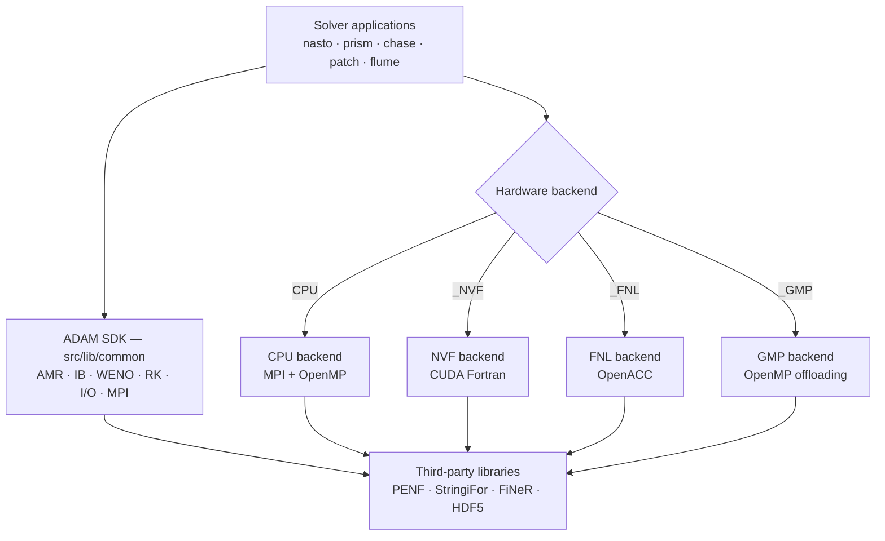
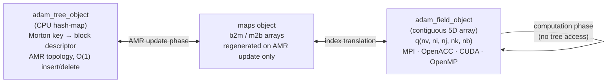

# Architecture

## Overview

ADAM is a **physics-agnostic SDK** for building high-performance CFD solvers. Its core infrastructure — block-structured AMR, immersed boundary method, high-order WENO numerics, Runge-Kutta time integration, and parallel I/O — is fully decoupled from any specific set of governing equations. Solvers are assembled by composing these building blocks and adding only the physics-specific layer on top.

ADAM targets the full spectrum of modern HPC hardware without changing application source code or input files:

- **CPU-based clusters** — MPI distributed-memory parallelism with shared-memory OpenMP threading
- **CPU+GPU accelerated clusters** — node-level GPU parallelism via CUDA Fortran (NVIDIA), OpenACC, or OpenMP offloading; multi-node scaling via MPI with GPU-aware communication over NVLink or InfiniBand

The choice of hardware backend is a compile-time switch; everything above the backend layer — physics, numerics, I/O, configuration — is identical.



## SDK Layer — `src/lib`

The SDK provides physics-agnostic building blocks reused identically by every application.

### Core objects (`src/lib/common`)

| Object | Purpose |
|--------|---------|
| `adam_grid_object` | Block-structured grid management with AMR geometry |
| `adam_tree_object` | Octree/quadtree with Morton-order linearization |
| `adam_field_object` | 5D field arrays `(nv, ni, nj, nk, nb)` — storage, interpolation, ghost exchange |
| `adam_weno_object` | High-order WENO reconstruction (orders 3–11) |
| `adam_rk_object` | Runge-Kutta temporal integration (SSP schemes) |
| `adam_ib_object` | Immersed boundary method with eikonal distance fields |
| `adam_io_object` | Parallel HDF5 output and restart files |
| `adam_mpih_object` | MPI wrapper and nearest-neighbor ghost cell communication |
| `adam_fdv_operators_library` | Gradient, divergence, curl, Laplacian finite difference operators |
| `adam_riemann_euler_library` | Riemann solvers for the Euler equations |

### Object ownership: the realm

Every library object belongs to a **realm** — the per-domain solver instance — as a component of `realm_object` (`src/lib/common/adam_realm_object.F90`), from which every application type inherits:

| Component | Type | Role |
|-----------|------|------|
| `adam` | `adam_object` | owns `grid`, `tree`, `field`, `maps` as value components |
| `io` | `io_object` | INI file handle, output/restart configuration |
| `amr` | `amr_object` | refinement markers |
| `weno`, `rk`, `ib` | `weno_object`, `rk_object`, `ib_object` | reconstruction, time integration, immersed boundary |
| `slices`, `flail`, `leapfrog`, `blanesmoan`, `cfm` | … | slices output, linear algebra, alternative integrators |

Library routines that need another object receive it **as an argument**, e.g. `call self%adam%field%update_ghost_local(grid=self%adam%grid, maps=self%adam%maps, q=q)`. Because each realm owns its objects, several realms (a multi-realm *forest*) coexist in one process without sharing state.

The only program-scope singletons are the MPI handlers, which are genuinely one per process: `mpih` (`adam_mpih_global`, CPU) and `mpih_fnl` (`adam_fnl_mpih_global`, FNL — it also owns the device context, so it must be initialised exactly once).

### FNL initialization order

FNL helpers (`field_fnl`, `ib_fnl`, `rk_fnl`, `weno_fnl`, and app-specific ones such as PRISM's `coil_fnl`) are components of the application's FNL type, one set per realm. They are initialised **after** the common (CPU) initialisation, from the realm's own objects:

```fortran
! prism_fnl_object%initialize_prism (adam_prism_fnl_object.F90)
if (.not.mpih_fnl_is_initialized) then                                           ! once per process
   call mpih_fnl%initialize(do_mpi_init=..., do_device_init=.true.)
   mpih_fnl_is_initialized = .true.
endif
call self%prism_common_object%initialize(filename=filename, memory_avail=memory_avail_, verbose=.true.)
call self%field_fnl%initialize(grid=self%adam%grid, field=self%adam%field, maps=self%adam%maps, verbose=.true.)
call self%ib_fnl%initialize(grid=self%adam%grid, field=self%adam%field, ib=self%ib)
call self%rk_fnl%initialize(grid=self%adam%grid, field=self%adam%field, rk=self%rk)
call self%weno_fnl%initialize(weno=self%weno)
```

### Backend libraries

Each backend extends the common objects with hardware-specific implementations:

| Directory | Backend | Parallelism model |
|-----------|---------|-------------------|
| `src/lib/common` | CPU | MPI + OpenMP |
| `src/lib/nvf` | NVF | CUDA Fortran (NVIDIA GPUs) |
| `src/lib/fnl` | FNL | OpenACC (NVIDIA/AMD GPUs) |
| `src/lib/gmp` | GMP | OpenMP target offloading (experimental) |

## Application Layer — `src/app`

Applications sit on top of the SDK and contribute only the physics-specific layer. The full HPC stack is inherited for free.

### Directory structure

```
src/
├── lib/                  # ADAM SDK
│   ├── common/           # Physics-agnostic core objects (portable, CPU)
│   ├── nvf/              # CUDA Fortran GPU backend
│   ├── fnl/              # OpenACC GPU backend
│   └── gmp/              # OpenMP offloading backend (in development)
├── app/                  # Solvers built on the SDK
│   ├── nasto/            # Compressible Navier-Stokes solver
│   ├── prism/            # Maxwell equations / plasma solver
│   ├── chase/            # CFD application
│   ├── patch/            # Patch-based application
│   ├── flume/            # Compressible MHD solver (planned)
│   └── ascot/            # Binary-to-ASCII output converter
├── tests/                # Unit and integration tests
└── third_party/          # Git submodules (PENF, StringiFor, FiNeR, VTKFortran, …)
```

### Backend pattern

Every application exposes the same set of backends via a parallel subdirectory layout:

```
app/<name>/common/    # Physics layer shared across all backends
app/<name>/cpu/       # CPU-only entry point (MPI + OpenMP)
app/<name>/nvf/       # CUDA Fortran entry point
app/<name>/fnl/       # OpenACC entry point
app/<name>/gmp/       # OpenMP offloading entry point
```

### Adding a new solver

A new physics application requires only implementing the problem-specific layer; the entire SDK is reused unchanged. The application type extends `realm_object`, inheriting every SDK object as a component, and adds only its physics-specific state:

```fortran
type, extends(realm_object) :: my_common_object
   ! inherited: io, amr, slices, weno, ib, rk, flail, adam (grid, tree, field, maps), ...
   real(R8P), allocatable  :: q(:,:,:,:,:)   ! conservative variables (nv, i, j, k, nb)
   type(my_physics_object) :: physics
   type(my_bc_object)      :: bc
   type(my_ic_object)      :: ic
   type(my_time_object)    :: time
endtype my_common_object

type, extends(my_common_object) :: my_cpu_object   ! and my_fnl_object for the GPU backend
   ...
endtype my_cpu_object
```

The common `initialize` reads the physics first (it decides `nv`), then calls `realm_object%initialize`, which builds grid, tree, maps, field, AMR, IB, slices, RK, WENO and FDV from the INI file:

```fortran
call self%io%initialize(filename=filename)                            ! INI file handle
call self%physics%initialize(file_parameters=self%io%file_parameters) ! decides nv
call self%realm_object%initialize(filename=filename, memory_avail=memory_avail, nv=self%physics%nv)
call self%bc%initialize(file_parameters=self%io%file_parameters)
call self%adam%grid%set_bc_type(bc_type=self%bc%bc_type)
```

The time loop is not written by the application: the program hands an array of realms to `forest_object%simulate`, which drives the `_forest` type-bound procedures (`initialize_forest`, `compute_local_dt_forest`, `advance_one_step_forest`, `post_step_forest`, `is_done_forest`, `finalize_forest`, plus the staged family used on AMR seams and multi-realm runs). PRISM (`src/app/prism`) is the reference implementation.

## AMR data design: inverse indexing

High-performance AMR requires resolving a fundamental tension: the grid topology changes dynamically at runtime (refinement, coarsening, load rebalancing), yet the numerical kernels must operate on dense, contiguous memory with no indirection overhead. ADAM resolves this by splitting the AMR data into two structurally opposite objects with complementary roles.

### Tree — flexible topology on the CPU

`adam_tree_object` is a **hash-map living entirely in CPU memory**. Its keys are 64-bit Morton indices that linearise the four octree coordinates `(level, bx, by, bz)` into a single integer; its values are lightweight block descriptor objects. This structure provides:

- **O(1) insertion and deletion** of blocks during refinement and coarsening steps
- **O(1) neighbour lookup** — the Morton key of any face/edge/corner neighbour can be computed arithmetically, with no pointer chasing
- **Spatial locality** — Morton ordering clusters geometrically adjacent blocks in index space, minimising ghost-cell communication volume across MPI ranks

The tree is never touched by numerical kernels. It is only consulted during the AMR update phase (marking → refinement/coarsening → load rebalancing) and to regenerate the index maps needed by the field object.

### Field — contiguous arrays for parallel computing

`adam_field_object` is a **dense, contiguous 5D array** allocated once at the beginning of the simulation:

```
field%q(nv, ni, nj, nk, nb)
```

| Dimension | Meaning |
|-----------|---------|
| `nv` | Physical variables (density, momenta, energy, …) |
| `ni, nj, nk` | Cell indices within a block, including ghost cells |
| `nb` | Block index — a compact integer from 1 to the current block count |

The block index `nb` is **not** the Morton key. It is a compact sequential integer assigned so that all blocks owned by an MPI rank occupy a contiguous slice of the array. This is the inverse of the tree's hash-map addressing — hence *inverse indexing*: the tree maps Morton keys → block descriptors, while the field maps compact block indices → raw data.

This layout guarantees:
- **Stride-1 access on the innermost dimension** (`nv`) in Fortran column-major order, enabling coalesced reads across CUDA threads or OpenACC/OpenMP SIMD lanes
- **No dynamic allocation during time integration** — the array is pre-allocated to the maximum block count and reused across all Runge-Kutta stages
- **Direct offload to device memory** — a single `!$acc data` or `cudaMemcpy` transfers the entire field; no pointer-based scatter/gather is needed

### The mapping layer

A lightweight mapping array (`maps`) bridges the two worlds. It is regenerated only when the AMR topology changes (a rare, synchronised event) and is otherwise invisible to numerical kernels:

```
maps%b2m(nb)   ! block index → Morton key  (field → tree lookup)
maps%m2b(key)  ! Morton key  → block index (tree  → field lookup)
```

During the computation phase — which accounts for the overwhelming majority of runtime — kernels iterate over the compact block index `nb` with no hash-map access, achieving the same memory access pattern as a static structured grid.



### Memory and parallelism summary

- **Ghost cells**: configurable width `ngc` (typically 3 for WENO5, 4 for WENO7); exchanged via MPI before each stencil sweep using the compact block index, not Morton keys.
- **Load balancing**: blocks are redistributed across MPI ranks by reordering the compact index using Morton space-filling curves, keeping the field array layout optimal after each rebalancing step.
- **Scalability target**: strong scaling to O(1000) GPUs with >70% parallel efficiency.

## Configuration

All applications are configured through human-readable INI files (parsed by FiNeR). No recompilation is needed to change physics, numerics, grid, or I/O settings:

- Grid parameters — domain bounds, resolution, ghost cell width
- Physics parameters — gas properties, Reynolds/Mach numbers
- Numerical parameters — WENO order, Runge-Kutta scheme
- Boundary and initial conditions
- I/O options and AMR refinement criteria
