### coverage-analysis

#### [[penf_stringify.F90.gcov]]

|Lines| | |
| --- | --- | --- |
|Executable lines            |273| |
|Executed lines              |27|10%|
|Unexecuted lines            |246|90%|
|Average hits / executed     |636385.7777777778| |

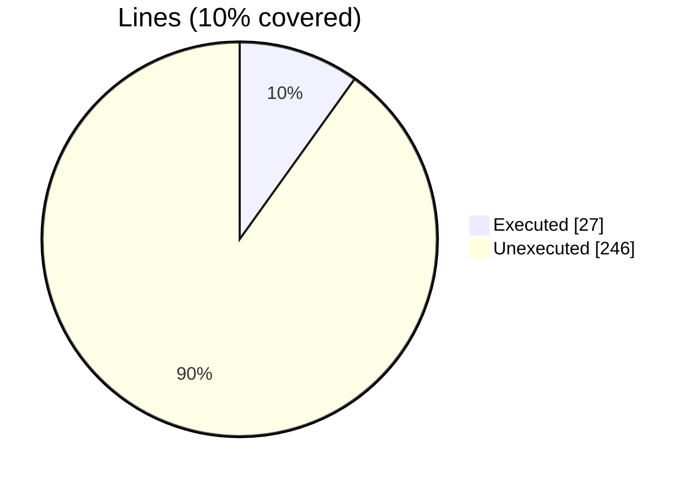

|Procedures| | |
| --- | --- | --- |
|Total procedures            |44| |
|Executed procedures         |4|9%|
|Unexecuted procedures       |40|91%|
|Average hits / executed     |712701.0| |

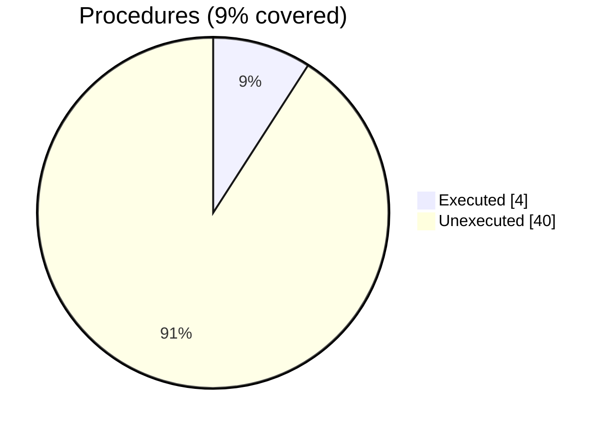


#### [[test_fdv_gradient_trigonometric.F90.gcov]]

|Lines| | |
| --- | --- | --- |
|Executable lines            |76| |
|Executed lines              |76|100%|
|Unexecuted lines            |0|0%|
|Average hits / executed     |51023.44736842105| |

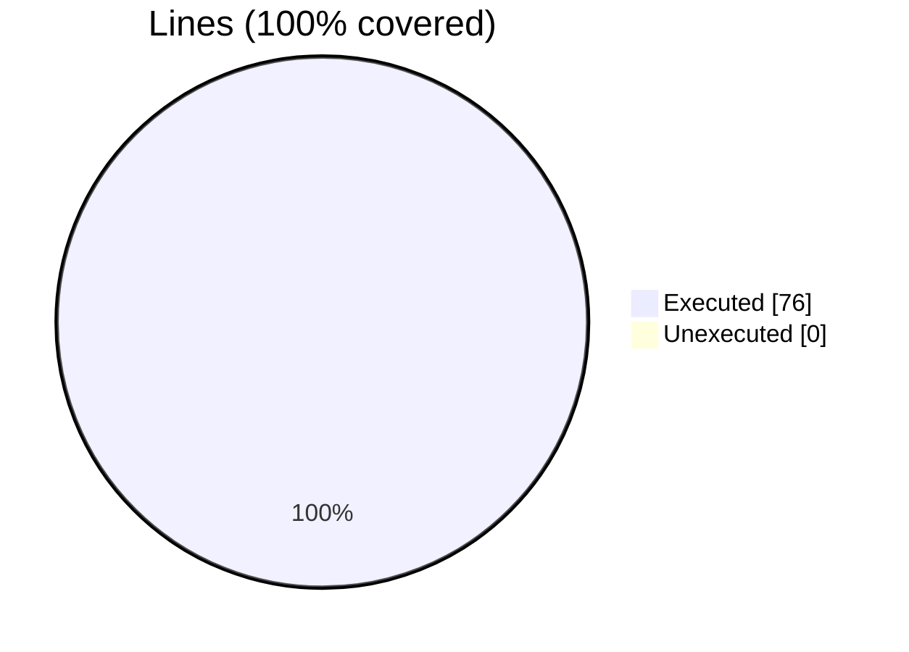

|Procedures| | |
| --- | --- | --- |
|Total procedures            |1| |
|Executed procedures         |1|100%|
|Unexecuted procedures       |0|0%|
|Average hits / executed     |10.0| |

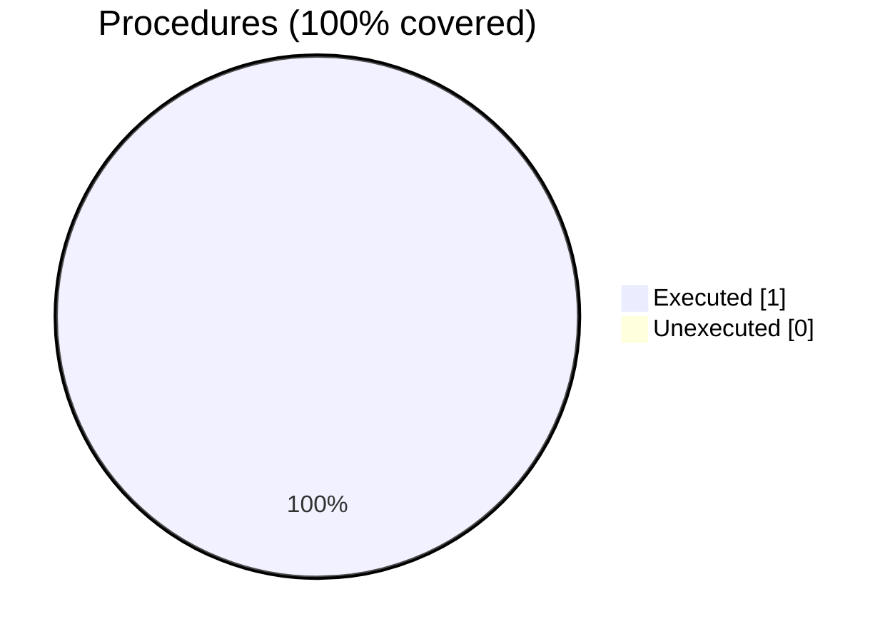


#### [[penf.F90.gcov]]

|Lines| | |
| --- | --- | --- |
|Executable lines            |80| |
|Executed lines              |0|0%|
|Unexecuted lines            |80|100%|
|Average hits / executed     |0| |

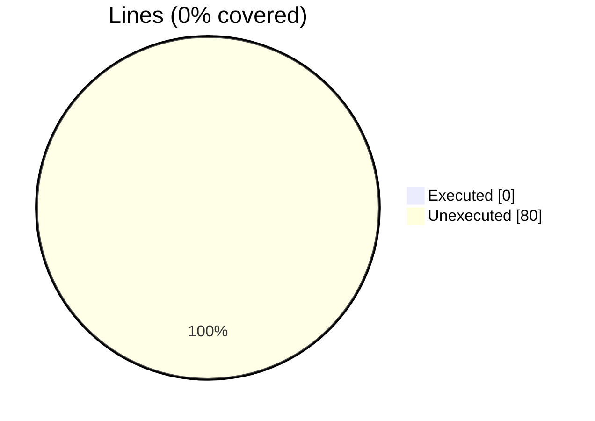

|Procedures| | |
| --- | --- | --- |
|Total procedures            |8| |
|Executed procedures         |0|0%|
|Unexecuted procedures       |8|100%|
|Average hits / executed     |0| |


#### [[test_fdv_divergence_trigonometric.F90.gcov]]

|Lines| | |
| --- | --- | --- |
|Executable lines            |69| |
|Executed lines              |69|100%|
|Unexecuted lines            |0|0%|
|Average hits / executed     |26824.521739130436| |


|Procedures| | |
| --- | --- | --- |
|Total procedures            |1| |
|Executed procedures         |1|100%|
|Unexecuted procedures       |0|0%|
|Average hits / executed     |10.0| |


#### [[test_fdv_curl_trigonometric.F90.gcov]]

|Lines| | |
| --- | --- | --- |
|Executable lines            |75| |
|Executed lines              |75|100%|
|Unexecuted lines            |0|0%|
|Average hits / executed     |52677.09333333333| |


|Procedures| | |
| --- | --- | --- |
|Total procedures            |1| |
|Executed procedures         |1|100%|
|Unexecuted procedures       |0|0%|
|Average hits / executed     |10.0| |


#### [[test_fdv_operators_trigonometric.F90.gcov]]

|Lines| | |
| --- | --- | --- |
|Executable lines            |105| |
|Executed lines              |101|96%|
|Unexecuted lines            |4|4%|
|Average hits / executed     |723.4059405940594| |

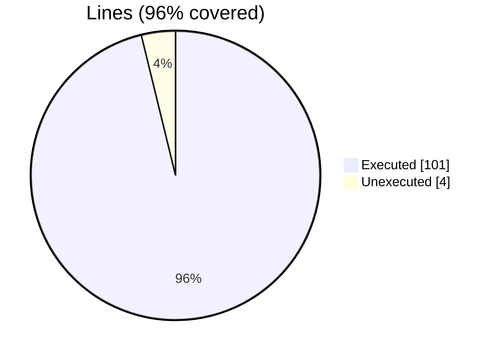

|Procedures| | |
| --- | --- | --- |
|Total procedures            |1| |
|Executed procedures         |1|100%|
|Unexecuted procedures       |0|0%|
|Average hits / executed     |51.0| |


#### [[penf_b_size.F90.gcov]]

|Lines| | |
| --- | --- | --- |
|Executable lines            |26| |
|Executed lines              |0|0%|
|Unexecuted lines            |26|100%|
|Average hits / executed     |0| |

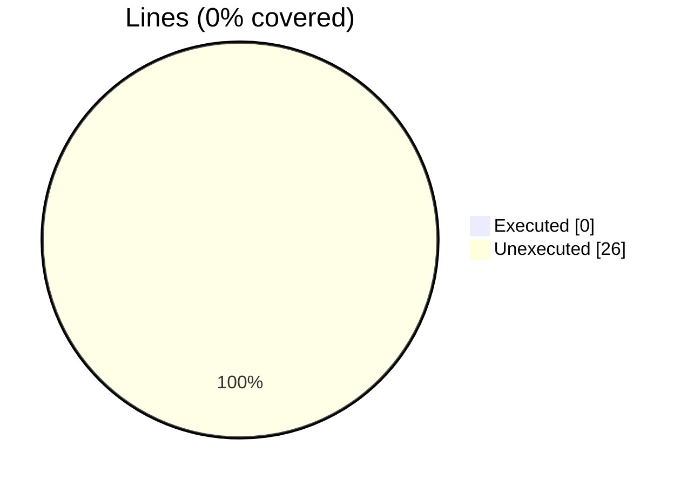

|Procedures| | |
| --- | --- | --- |
|Total procedures            |10| |
|Executed procedures         |0|0%|
|Unexecuted procedures       |10|100%|
|Average hits / executed     |0| |

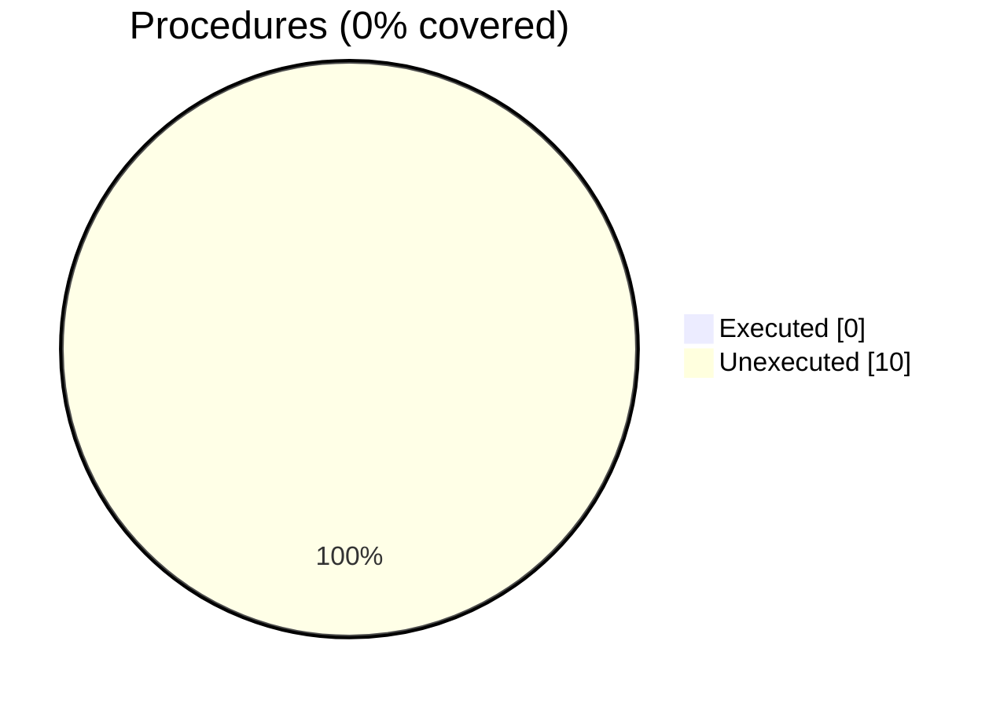


#### [[test_fdv_laplacian_trigonometric.F90.gcov]]

|Lines| | |
| --- | --- | --- |
|Executable lines            |69| |
|Executed lines              |69|100%|
|Unexecuted lines            |0|0%|
|Average hits / executed     |16207.188405797102| |


|Procedures| | |
| --- | --- | --- |
|Total procedures            |1| |
|Executed procedures         |1|100%|
|Unexecuted procedures       |0|0%|
|Average hits / executed     |6.0| |


#### [[adam_fdv_operators_library.F90.gcov]]

|Lines| | |
| --- | --- | --- |
|Executable lines            |202| |
|Executed lines              |172|85%|
|Unexecuted lines            |30|15%|
|Average hits / executed     |136900.0| |

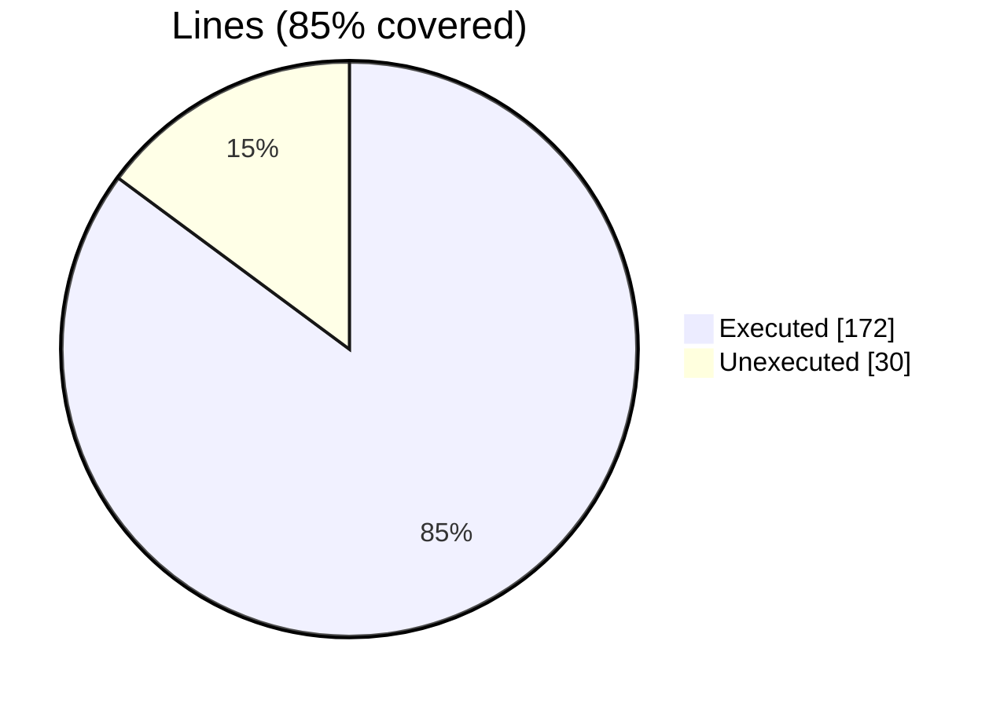

|Procedures| | |
| --- | --- | --- |
|Total procedures            |36| |
|Executed procedures         |30|83%|
|Unexecuted procedures       |6|17%|
|Average hits / executed     |84536.66666666667| |

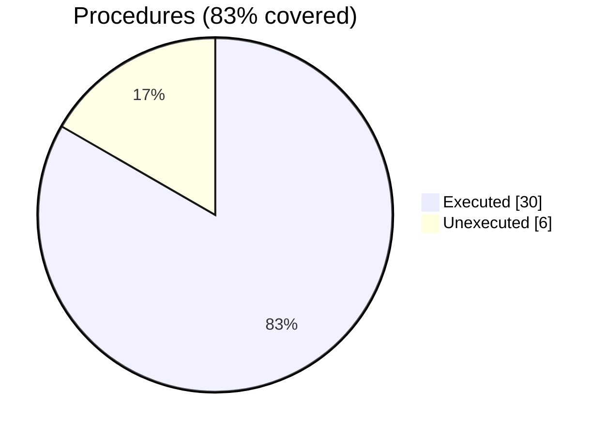


#### [[penf_allocatable_memory.F90.gcov]]

|Lines| | |
| --- | --- | --- |
|Executable lines            |870| |
|Executed lines              |0|0%|
|Unexecuted lines            |870|100%|
|Average hits / executed     |0| |

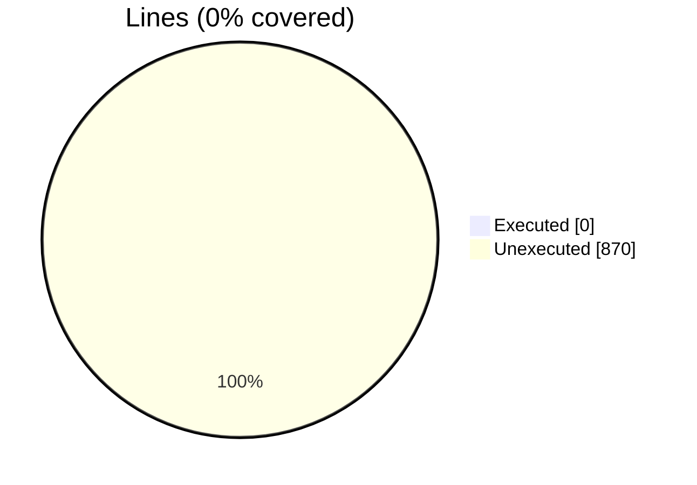

|Procedures| | |
| --- | --- | --- |
|Total procedures            |87| |
|Executed procedures         |0|0%|
|Unexecuted procedures       |87|100%|
|Average hits / executed     |0| |


#### [[test_fdv_operators_step.F90.gcov]]

|Lines| | |
| --- | --- | --- |
|Executable lines            |46| |
|Executed lines              |46|100%|
|Unexecuted lines            |0|0%|
|Average hits / executed     |391.7608695652174| |

```mermaid
pie showData
    title Lines (100% covered)
    "Executed" : 46
    "Unexecuted" : 0
```

|Procedures| | |
| --- | --- | --- |
|Total procedures            |1| |
|Executed procedures         |1|100%|
|Unexecuted procedures       |0|0%|
|Average hits / executed     |14.0| |

```mermaid
pie showData
    title Procedures (100% covered)
    "Executed" : 1
    "Unexecuted" : 0
```

