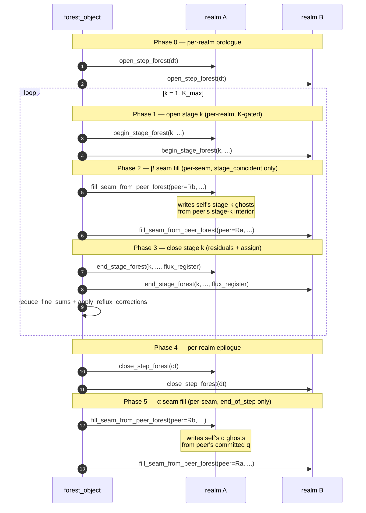
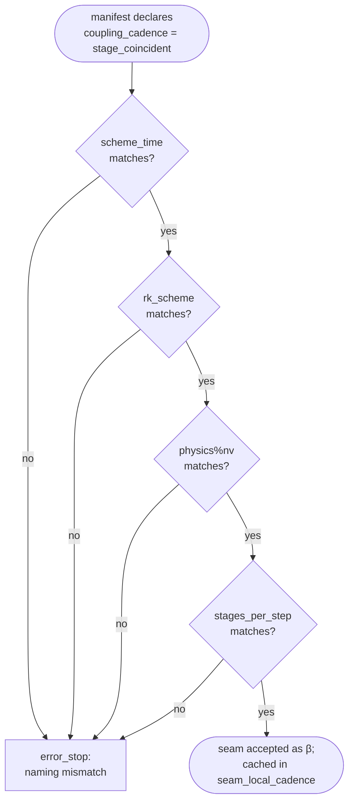

# Forest (multi-realm)

ADAM's **forest** is the orchestrator that drives more than one independent simulation domain — a **realm** — through a synchronized time loop. Realms share a global timestep but may differ in spatial grid, integrator stride, and spatial operator. Inter-realm seams (faces where two realms touch) are coupled via ghost-cell exchanges whose cadence is selected per seam in the manifest.

Two flagship use cases motivate the multi-realm machinery:

- **Asymmetric integrator stride** — one realm advances on SSP-RK-3 for a stiff region while another uses SSP-RK-5 for a region requiring higher temporal accuracy, both with the same global `dt`.
- **Accuracy-driven spatial decomposition** — one realm uses WENO-7 near shocks while another uses FD-centered in smooth regions; both run the same RK scheme but with operators tuned to their local physics regime.

The first scenario requires the **α (end-of-step)** seam-coupling cadence, the AMReX-aligned default. The second is best served by **β (stage-coincident)**, the opt-in alternative that recovers single-realm temporal accuracy at the seam.

## The manifest

A forest is declared by a small INI file. PRISM and other apps auto-detect a manifest by looking for a `[forest]` section; a plain single-realm INI is dispatched through the legacy N=1 fast path with zero overhead.

```ini
; forest.ini — minimal two-realm manifest

[forest]
realms_number = 2

[realm.1]
ini = realm_1.ini       ; path relative to forest.ini's directory

[realm.2]
ini = realm_2.ini

[forest.topology]
inter_realm_faces_number = 1

[forest.topology.face_1]
realm_a          = 1
face_a           = +x                  ; realm 1's +x face is glued to realm 2's -x face
realm_b          = 2
face_b           = -x
coupling         = mirror              ; mirror | periodic | interpolate
coupling_cadence = end_of_step         ; end_of_step (default, α) | stage_coincident (β)
```

Schema summary:

| Section | Key | Required | Description |
|---|---|---|---|
| `[forest]`                       | `realms_number`             | yes | Number of realms in the forest (≥ 1). |
| `[realm.N]`                      | `ini`                       | yes | Per-realm INI path, relative to the manifest's directory. |
| `[forest.topology]`              | `inter_realm_faces_number`  | no  | Count of inter-realm seams; absent means no inter-realm coupling. |
| `[forest.topology.face_N]`       | `realm_a`, `realm_b`        | yes | 1-based realm indices on each side of the seam. |
|                                  | `face_a`, `face_b`          | yes | Face codes: `+x`/`-x`/`+y`/`-y`/`+z`/`-z`. |
|                                  | `coupling`                  | no  | `mirror` (default; pass-through copy), `periodic`, `interpolate` (reserved). |
|                                  | `coupling_cadence`          | no  | `end_of_step` (default, α) or `stage_coincident` (β). |

Each realm's INI is a complete per-app input file. Sections like `[grid]`, `[numerics]`, `[physics]`, `[runge_kutta]` are populated as usual; the manifest contributes only the inter-realm topology.

## Coupling cadence: α vs β

Each inter-realm seam carries a `coupling_cadence` selected independently in the manifest. The forest's `evolve_one_step` orchestrator iterates seams (not realms) when filling ghost cells and gates per-seam.

### α — end_of_step (default)

Mid-step peer ghosts are intentionally stale-by-one-step. Each realm reads peer ghosts established by the previous timestep's end-of-step exchange (or by the initial-condition seam fill, on the first step). At the end of every global timestep, after every realm has completed its `close_step_forest`, the forest fires one synchronized inter-realm exchange across all α seams.

This is the **AMReX `FillCoarsePatch` convention** (Berger-Oliger 1984; AMReX `Amr.cpp::timeStep`). It is well-understood numerically and admits **asymmetric per-realm K**: a forest may mix SSP-RK-3 and SSP-RK-5 realms without restructuring.

The cost is structural: **first-order seam coupling in time**, while the per-realm interior keeps the full RK order. Far from steep gradients the effect is benign.

When to use α:

- Realms with different RK strides (asymmetric K).
- Heterogeneous physics regions where seam coupling order is not the dominant accuracy concern.
- As the default choice when in doubt.

### β — stage_coincident (opt-in)

Peer ghosts are refreshed **once per RK substage**, inside the K loop, before `end_stage_forest` computes residuals. Each realm reads peer's stage-`k` interior at substage `k`, giving the seam the same temporal order as the per-realm interior.

When admissibility holds (see below), β recovers bit-equivalence to a monolithic single-realm run on the union grid. This is the strong oracle the `rmf-2realm-stagesync` regression case enforces continuously on every CI run.

When to use β:

- Realms share the **same** ODE solver and stage count, but differ in **spatial** operator (the spatial-accuracy decomposition use case).
- Seam-coupling time order matters: e.g., wave propagation crossing the seam, where first-order coupling would visibly drift.
- Production runs where the marginal cost of K extra exchanges per step is worth the gained order.

### Admissibility (β)

β is admissible on a seam iff both endpoint realms agree on:

1. **ODE solver scheme**: `numerics%scheme_time` AND `rk%scheme` (e.g., both `runge-kutta-ssp-54`).
2. **Stage count**: `rk%nrk` — the K each realm reports through `stages_per_step_forest()`.
3. **Physics layout**: `physics%nv` (and the per-variable index assignments).

Spatial operator (`numerics%scheme_space`) and grid resolution MAY differ. That is precisely the use case β exists to serve.

The forest enforces admissibility at init time via `check_beta_admissibility`. Any disagreement triggers an immediate `error_stop` naming the offending face_pair and the specific descriptor field that mismatched. **No silent downgrade to α.** β is opt-in — if you asked for it and the manifest is inadmissible, you want to know loudly.

### Decision table

| Your realms have... | Choose |
|---|---|
| Different RK schemes / strides (K) | **α** — β is not admissible |
| Different `physics%nv` (one CT-divergence-corrected, one not) | **α** — β is not admissible |
| Same RK, same physics, **same** spatial operator | **β** — full equivalence to single-realm |
| Same RK, same physics, **different** spatial operators | **β** — recovers seam temporal order |
| You're prototyping a new manifest and just want it to run | **α** — works in every case |

## The orchestrator step cycle

`forest_object%evolve_one_step` drives a synchronized timestep across all realms. The structure of one timestep:



Per-seam gating: Phase 2 fires only on seams declared `stage_coincident` (β); Phase 5 fires only on seams declared `end_of_step` (α). A seam is filled exactly once per step under either cadence — Phase 2 may execute K times per step but at successive substages, never duplicating the same substage.

**Load-bearing invariant under β**: Phase 2 must complete on ALL realms before Phase 3 starts on ANY realm. Otherwise the read-after-overwrite race between `fill_seam_from_peer_forest` writes and `compute_residuals` reads returns. The serial inner loops within a rank give this for free under the current Phase-A replicated-forest layout.

K-gating in Phases 1 and 3: realm `is` participates only when `k ≤ K_realm(is) = realm(is)%stages_per_step_forest()`. A realm with K < K_max no-ops the trailing stages, which is what makes asymmetric K work under α. Under β the admissibility check requires equal K, so the gate is vacuous.

## Reflux at α.r1

`flux_register`'s third axis is collapsed to size 1 (α.r1; PRD #16 M2). Realms gate their reflux body on each realm's final RK substage:

```fortran
if (stage /= self%rk%nrk) return    ! α.r1 end-of-step gate
```

The mid-step `apply_reflux_corrections` call in the orchestrator fires for every `k`, but real reflux work happens exactly once per realm per step at its own end-of-step. This is independent of α/β: **β does not restore Wang 2018 per-stage RK-weighted reflux** — that refinement is deferred to a future milestone.

## Admissibility flow (β)



The check runs once, at forest init, after every realm's `initialize_forest` has populated its components. The cached `seam_local_cadence(p)` is then consumed by `evolve_one_step` at every step without further per-step manifest reads.

## Sibling regression cases

Three regression cases under `src/tests/prism/regression/` cover the full cadence × K matrix. Each runs on both CPU and FNL backends.

| Case | Cadence | K_realm | Oracle |
|---|---|---|---|
| `rmf-2realm`            | α | 5 / 5 | own α golden |
| `rmf-2realm-asymK`      | α | 3 / 5 | own α golden (the asymmetric-K validation) |
| `rmf-2realm-stagesync`  | β | 5 / 5 | own β golden **+** continuous match against `rmf/golden/<backend>/digest.txt` |

The third case is the load-bearing β oracle. Under same-K, same-physics, same-ODE decomposition, the multi-realm digest matches the **single-realm** rmf digest bit-for-bit (within `rtol=1e-06`, `atol=1e-3`). Per-block metadata (`dxdydz`, `origin`, `time_iteration`) differs by block-count scaling and is automatically downgraded to `SKIP_METADATA` by `digest.py compare`. The harness fires this cross-config check on every regression run; any future refactor that breaks bit-equivalence is caught immediately.

## Further reading

- **Manifest parser**: `src/lib/common/adam_forest_manifest.F90` — INI schema, parser, the `forest_manifest_t` and `forest_face_pair_t` structs.
- **Orchestrator**: `src/lib/common/adam_forest_object.F90` — `forest_object` and `evolve_one_step`'s phase outline in the source docstring.
- **Realm contract**: `src/lib/common/adam_realm_object.F90` — the `_forest`-suffixed TBP family every app extension overrides. See also `src/lib/common/README.md` ("Forest orchestration" section) for the library-developer view.
- **Sibling case READMEs**: `src/tests/prism/regression/rmf-2realm/README.md` (α), `src/tests/prism/regression/rmf-2realm-asymK/README.md` (asymK), `src/tests/prism/regression/rmf-2realm-stagesync/README.md` (β).
- **Design history**: GitHub issue [#10](https://github.com/szaghi/adam/issues/10) (Phase D inception), [#13](https://github.com/szaghi/adam/issues/13) (interface machinery), [#16](https://github.com/szaghi/adam/issues/16) (α end-of-step barrier), [#18](https://github.com/szaghi/adam/issues/18) (β stage-coincident recovery).
