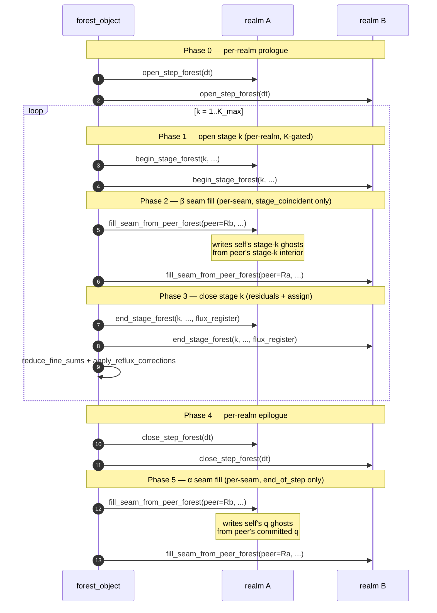

# Forest (multi-realm)

ADAM's **forest** is the orchestrator that drives more than one independent simulation domain — a **realm** — through a synchronized time loop. Realms share a global timestep but may differ in spatial grid, integrator stride, and spatial operator. Inter-realm seams (faces where two realms touch) are coupled via ghost-cell exchanges whose cadence is selected per seam in the manifest.

Two flagship use cases motivate the multi-realm machinery:

- **Asymmetric integrator stride** — one realm advances on SSP-RK-3 for a stiff region while another uses SSP-RK-5 for a region requiring higher temporal accuracy, both with the same global `dt`.
- **Accuracy-driven spatial decomposition** — one realm uses WENO-7 near shocks while another uses FD-centered in smooth regions; both run the same RK scheme but with operators tuned to their local physics regime.

The first scenario requires the **α (end-of-step)** seam-coupling cadence, the AMReX-aligned default. The second is best served by **β (stage-coincident)**, the opt-in alternative that recovers single-realm temporal accuracy at the seam.

## The manifest

A forest is declared by a small INI file. PRISM and other apps auto-detect a manifest by looking for a `[forest]` section; a plain single-realm INI is dispatched through the legacy N=1 fast path with zero overhead.

```ini
; forest.ini — minimal two-realm manifest

[forest]
realms_number = 2

[realm.1]
ini = realm_1.ini       ; path relative to forest.ini's directory

[realm.2]
ini = realm_2.ini

[forest.topology]
inter_realm_faces_number = 1

[forest.topology.face_1]
realm_a          = 1
face_a           = +x                  ; realm 1's +x face is glued to realm 2's -x face
realm_b          = 2
face_b           = -x
coupling         = mirror              ; mirror | periodic | interpolate
coupling_cadence = end_of_step         ; end_of_step (default, α) | stage_coincident (β)
```

Schema summary:

| Section | Key | Required | Description |
|---|---|---|---|
| `[forest]`                       | `realms_number`             | yes | Number of realms in the forest (≥ 1). |
| `[realm.N]`                      | `ini`                       | yes | Per-realm INI path, relative to the manifest's directory. |
| `[forest.topology]`              | `inter_realm_faces_number`  | no  | Count of inter-realm seams; absent means no inter-realm coupling. |
| `[forest.topology.face_N]`       | `realm_a`, `realm_b`        | yes | 1-based realm indices on each side of the seam. |
|                                  | `face_a`, `face_b`          | yes | Face codes: `+x`/`-x`/`+y`/`-y`/`+z`/`-z`. |
|                                  | `coupling`                  | no  | `mirror` (default; pass-through copy), `periodic`, `interpolate` (reserved). |
|                                  | `coupling_cadence`          | no  | `end_of_step` (default, α) or `stage_coincident` (β). |

Each realm's INI is a complete per-app input file. Sections like `[grid]`, `[numerics]`, `[physics]`, `[runge_kutta]` are populated as usual; the manifest contributes only the inter-realm topology.

## Coupling cadence: α vs β

Each inter-realm seam carries a `coupling_cadence` selected independently in the manifest. The forest's `evolve_one_step` orchestrator iterates seams (not realms) when filling ghost cells and gates per-seam.

### α — end_of_step (default)

Mid-step peer ghosts are intentionally stale-by-one-step. Each realm reads peer ghosts established by the previous timestep's end-of-step exchange (or by the initial-condition seam fill, on the first step). At the end of every global timestep, after every realm has completed its `close_step_forest`, the forest fires one synchronized inter-realm exchange across all α seams.

This is the **AMReX `FillCoarsePatch` convention** (Berger-Oliger 1984; AMReX `Amr.cpp::timeStep`). It is well-understood numerically and admits **asymmetric per-realm K**: a forest may mix SSP-RK-3 and SSP-RK-5 realms without restructuring.

The cost is structural: **first-order seam coupling in time**, while the per-realm interior keeps the full RK order. Far from steep gradients the effect is benign.

When to use α:

- Realms with different RK strides (asymmetric K).
- Heterogeneous physics regions where seam coupling order is not the dominant accuracy concern.
- As the default choice when in doubt.

### β — stage_coincident (opt-in)

Peer ghosts are refreshed **once per RK substage**, inside the K loop, before `end_stage_forest` computes residuals. Each realm reads peer's stage-`k` interior at substage `k`, giving the seam the same temporal order as the per-realm interior.

When admissibility holds (see below), β recovers bit-equivalence to a monolithic single-realm run on the union grid. This is the strong oracle the `rmf-2realm-stagesync` regression case enforces continuously on every CI run.

When to use β:

- Realms share the **same** ODE solver and stage count, but differ in **spatial** operator (the spatial-accuracy decomposition use case).
- Seam-coupling time order matters: e.g., wave propagation crossing the seam, where first-order coupling would visibly drift.
- Production runs where the marginal cost of K extra exchanges per step is worth the gained order.

### Admissibility (β)

β is admissible on a seam iff both endpoint realms agree on:

1. **ODE solver scheme**: `numerics%scheme_time` AND `rk%scheme` (e.g., both `runge-kutta-ssp-54`).
2. **Stage count**: `rk%nrk` — the K each realm reports through `stages_per_step_forest()`.
3. **Physics layout**: `physics%nv` (and the per-variable index assignments).

Spatial operator (`numerics%scheme_space`) and grid resolution MAY differ. That is precisely the use case β exists to serve.

The forest enforces admissibility at init time via `check_beta_admissibility`. Any disagreement triggers an immediate `error_stop` naming the offending face_pair and the specific descriptor field that mismatched. **No silent downgrade to α.** β is opt-in — if you asked for it and the manifest is inadmissible, you want to know loudly.

### Decision table

| Your realms have... | Choose |
|---|---|
| Different RK schemes / strides (K) | **α** — β is not admissible |
| Different `physics%nv` (one CT-divergence-corrected, one not) | **α** — β is not admissible |
| Same RK, same physics, **same** spatial operator | **β** — full equivalence to single-realm |
| Same RK, same physics, **different** spatial operators | **β** — recovers seam temporal order |
| You're prototyping a new manifest and just want it to run | **α** — works in every case |

## The orchestrator step cycle

`forest_object%evolve_one_step` drives a synchronized timestep across all realms. The structure of one timestep:



Per-seam gating: Phase 2 fires only on seams declared `stage_coincident` (β); Phase 5 fires only on seams declared `end_of_step` (α). A seam is filled exactly once per step under either cadence — Phase 2 may execute K times per step but at successive substages, never duplicating the same substage.

**Load-bearing invariant under β**: Phase 2 must complete on ALL realms before Phase 3 starts on ANY realm. Otherwise the read-after-overwrite race between `fill_seam_from_peer_forest` writes and `compute_residuals` reads returns. The serial inner loops within a rank give this for free under the current Phase-A replicated-forest layout.

K-gating in Phases 1 and 3: realm `is` participates only when `k ≤ K_realm(is) = realm(is)%stages_per_step_forest()`. A realm with K < K_max no-ops the trailing stages, which is what makes asymmetric K work under α. Under β the admissibility check requires equal K, so the gate is vacuous.

## Reflux at α.r1

`flux_register`'s third axis is collapsed to size 1 (α.r1; PRD #16 M2). Realms gate their reflux body on each realm's final RK substage:

```fortran
if (stage /= self%rk%nrk) return    ! α.r1 end-of-step gate
```

The mid-step `apply_reflux_corrections` call in the orchestrator fires for every `k`, but real reflux work happens exactly once per realm per step at its own end-of-step. This is independent of α/β: **β does not restore Wang 2018 per-stage RK-weighted reflux** — that refinement is deferred to a future milestone.

## Admissibility flow (β)


The check runs once, at forest init, after every realm's `initialize_forest` has populated its components. The cached `seam_local_cadence(p)` is then consumed by `evolve_one_step` at every step without further per-step manifest reads.

## The other seam family: intra-realm AMR seams

Everything above concerns **inter-realm** seams — faces where two realms declared in a manifest touch. There is a second, independent seam family: the **intra-realm AMR seam**, a 2:1 resolution jump *inside a single realm's* Morton octree, where a level-`ℓ` block abuts a level-`ℓ+1` block. This is not manifest-declared; it arises from AMR refinement markers (`[amr] markers_number ≥ 1`).

The two families are structurally disjoint and use different machinery:

| | Inter-realm seam | Intra-realm AMR seam |
|---|---|---|
| Declared by | `[forest]` manifest face-pairs | AMR refinement markers |
| Resolution | same (1:1 mirror) | 2:1 coarse↔fine jump |
| Ghost fill | `fill_seam_from_peer_forest` (peer interior → self ghost) | `update_ghost_local` flag-4 path → `interp_seam_ghost` |
| Fill regime | pure copy (`COUPLING_MIRROR`) | selectable: injection / restriction-compatible / **tricubic** |
| Cadence | α / β per seam | intrinsic to `update_ghost` (every stage) |
| Registered as | `SEAM_KIND_INTER_REALM` | `SEAM_KIND_INTRA_REALM_AMR` |
| Reflux | inter-realm flux register | Berger-Colella reflux at the 2:1 face |

A single-realm run with no manifest never touches the inter-realm path; a forest of same-resolution realms never touches the AMR-seam path. Both can coexist (a forest of realms, each internally AMR-refined).

### Coarse→fine ghost fill regime (`[amr] seam_ghost_fill`)

At an intra-realm 2:1 seam, the fine block's ghost cells overlapping the coarse neighbour must be filled by interpolation. The regime is selected in the `[amr]` section:

```ini
[amr]
seam_ghost_fill = tricubic   ; injection | restriction-compatible | tricubic
```

| Value | Enum | Order | Footprint | Notes |
|---|---|---|---|---|
| `injection`              | `SEAM_FILL_INJECTION`  | 0 (legacy) | 1 | straight copy of the coarse value |
| `restriction-compatible` | `SEAM_FILL_COMPATIBLE` | q=2 | 3 | exact `R∘P = I` restriction-compatible stencil |
| `tricubic`               | `SEAM_FILL_TRICUBIC`   | q=4 | 4 | high-order tensor-product cubic |

**Effective default is `tricubic`**: when the `[amr] seam_ghost_fill` key is absent, `adam_object%initialize` sets `maps%seam_ghost_fill = SEAM_FILL_TRICUBIC` (`adam_adam_object.F90:236`). (The `adam_maps_object` struct initializer is `SEAM_FILL_INJECTION` — a latent fallback only reachable if the parse block is bypassed; the two literals disagree by design, with the runtime override winning.) The FNL device path carries the regime through `update_ghost_local_gpu(..., seam_ghost_fill=self%maps%seam_ghost_fill, ...)`.

The map-row flag (column 9 of the local ghost map) is a *separate* selector: value `4` routes a ghost cell to `interp_seam_ghost` (the coarse→fine path); `1` is plain injection copy, `8` is coarsening mean. The `seam_ghost_fill` regime (0/1/2) is orthogonal — it chooses *how* the flag-4 cells interpolate.

### The 2:1 seam is not div-free (accept-truncation)

On a **uniform** grid PRISM holds `div(B) = 0` to machine precision — `compute_curl_fd_centered` and `compute_divergence_fd_centered` share the antisymmetric `FD1_CC` primitive, so `div_h(curl_h) ≡ 0` by operator commutation (a mimetic identity, Ranocha 2019 Remark 2.8). **At a 2:1 AMR seam this identity breaks**: coarse (Δx) and fine (Δx/2) sides difference with different-resolution stencils, commutation fails, and the seam injects an O(h^p) `div(B)` source. It is a **divergence-constraint violation, not an energy instability** (`‖B‖` stays flat while `div(B)` runs away). The source *converges under refinement* (`p_obs ≈ +1.15 → +2`) but is unbounded in `t` at fixed `h`. Five fix classes (matched ghost values, single-valued flux, matched-difference operator, full Dedner GLM, SBP+SAT) were ruled out with evidence; the resolution is **accept-truncation** (issue #29). The `rmf-amr-fd-pulse` case is the source-free convergence instrument.

### Seam div(B) guard-rail (`[IO]`)

Because the AMR-seam `div(B)` growth is otherwise silent, an opt-in run-time monitor lives in `save_divergence_history`:

```ini
[IO]
seam_divB_tol   = 1.0E-06   ; monitor threshold; <= 0 disables (default -1.0, off)
seam_divB_error = .false.   ; .true. = error_stop on exceedance; else warn-only
```

The monitor arms **only** when `seam_divB_tol > 0` **and** an intra-realm AMR seam is present (`allocated(maps%amr_seam_quadrant)`, populated by `register_intra_realm_amr_seams`). On `max|div(B)| > seam_divB_tol` it either `error_stop`s (`seam_divB_error = .true.`) or prints a warning and continues. It is off by default and never fires on non-AMR runs (`adam_prism_common_object.F90:448-461`). To *delay* (not cure) the runaway on long AMR runs, enable `divergence_correction = hyperbolic` (requires `constrained_transport = D/B/DB`, the [issue #11] hazard) and tune `[physics].c_r` (default `0.18`).

[issue #11]: https://github.com/szaghi/adam/issues/11
[issue #29]: https://github.com/szaghi/adam/issues/29

## Regression coverage

The cadence × K matrix and both seam families are covered by cases under `src/tests/prism/regression/`, each run on both CPU and FNL backends at `mpirun -np 2`. See the [PRISM regression suite](/tests/prism-regression) page for the full harness design and per-case goals.

**Inter-realm cases:**

| Case | Cadence | K_realm | Oracle |
|---|---|---|---|
| `rmf-2realm`            | α | 5 / 5 | own α golden (single-realm `rmf` split at x=0) |
| `rmf-2realm-asymK`      | α | 3 / 5 | own α golden — the asymmetric-K validation (SSP-33 ∥ SSP-54) |
| `rmf-2realm-stagesync`  | β | 5 / 5 | own β golden **+** continuous match against `rmf/golden/<backend>/digest.txt` |
| `rmf-2realm-fd-pulse`   | β | 5 / 5 | the inter-realm 1:1 div-free reproducer (issue #31) — **manual only: no golden, no `check.sh`, skipped by `run.sh`** |

`rmf-2realm-stagesync` is the load-bearing β oracle: under same-K, same-physics, same-ODE decomposition the multi-realm digest matches the **single-realm** `rmf` digest within `(rtol=1e-06, atol=1e-3)` (per-block metadata auto-downgraded to `SKIP_METADATA`). The harness fires this cross-config check on every run.

`rmf-2realm-fd-pulse` documents [issue #31] (as a manual reproducer — it carries no golden and no `check.sh`, so `run.sh` skips it and nothing checks this automatically): a 1:1 same-resolution inter-realm mirror seam **must** be div-free like a 1:1 intra-block interface. It holds `div(B) = div(D) = 0` — but **only under β**. Under α the seam ghosts go unfilled during RK substages (`fill_seam_from_peer_forest` runs once per step, so substages 2..N read stale/zero seam ghosts), which leaks div(B). For a 1:1 same-`dt` seam, β is the correct and required cadence.

[issue #31]: https://github.com/szaghi/adam/issues/31

**Intra-realm AMR-seam cases** (goldenless, driven by a bespoke `check.sh` div-oracle rather than a committed digest):

| Case | Scheme | Oracle (`check.sh`) |
|---|---|---|
| `rmf-amr`         | `fv_centered` | refinement + registration + reflux fires; np1≡np2 register parity (#28) |
| `rmf-amr-fd`      | `fd_centered` | control `max|div(B)| ≤ 1e-13`; seam baseline ±5%; div(J) truthfulness band (#26) |
| `rmf-amr-fd-pulse`| `fd_centered` | source-free two-invariant oracle + `--convergence` `p_obs ≥ 0.8` ladder + RK-contract legs (#25) |

## Further reading

- **Manifest parser**: `src/lib/common/adam_forest_manifest.F90` — INI schema, parser, the `forest_manifest_t` and `forest_face_pair_t` structs; the `COUPLING_*`/`CADENCE_*` string→code mapping.
- **Orchestrator**: `src/lib/common/adam_forest_object.F90` — `forest_object`, `evolve_one_step`'s phase outline, `register_inter_realm_seams`, `register_intra_realm_amr_seams`, `build_seam_local_map`, `check_beta_admissibility`.
- **Realm contract**: `src/lib/common/adam_realm_object.F90` — the `_forest`-suffixed TBP family every app extension overrides (`fill_seam_from_peer_forest`, `coupling_descriptor_forest`, `apply_reflux_to_stage_forest`, `after_topology_build_forest`, ...). See also `src/lib/common/README.md` ("Forest orchestration" section) for the library-developer view.
- **Seam constants & maps**: `src/lib/common/adam_maps_object.F90` — `FACE_*`, `COUPLING_*`, `CADENCE_*`, the `seam_local_*` arrays; `src/lib/common/adam_seam_interpolation_library.F90` — `SEAM_FILL_*` regimes and stencils; `BC_SEAM` in `adam_parameters.f90`; `SEAM_KIND_*` in `adam_flux_register_object.F90`.
- **PRISM backend seam TBPs**: `src/app/prism/cpu/adam_prism_cpu_object.F90` (`fill_seam_from_peer_forest`, the issue-#31 diagnostic seam refill in `post_step_forest`) and its FNL twin `src/app/prism/fnl/adam_prism_fnl_object.F90` (the 4-kernel device seam fill, `after_topology_build_forest` device-map refresh).
- **Sibling case READMEs**: `src/tests/prism/regression/rmf-2realm/README.md` (α), `.../rmf-2realm-stagesync/README.md` (β), and the suite `README.md`.
- **Design history**: GitHub issues [#10](https://github.com/szaghi/adam/issues/10) (Phase D inception), [#13](https://github.com/szaghi/adam/issues/13) (interface machinery), [#16](https://github.com/szaghi/adam/issues/16) (α end-of-step barrier), [#18](https://github.com/szaghi/adam/issues/18) (β stage-coincident recovery), [#21](https://github.com/szaghi/adam/issues/21) (tricubic seam ghost fill), [#29](https://github.com/szaghi/adam/issues/29) (2:1 seam div(B) accept-truncation), [#31](https://github.com/szaghi/adam/issues/31) (inter-realm 1:1 seam + fWLayer HtoD).
