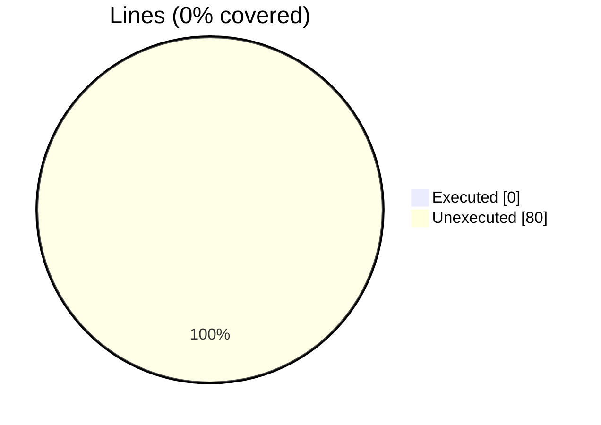
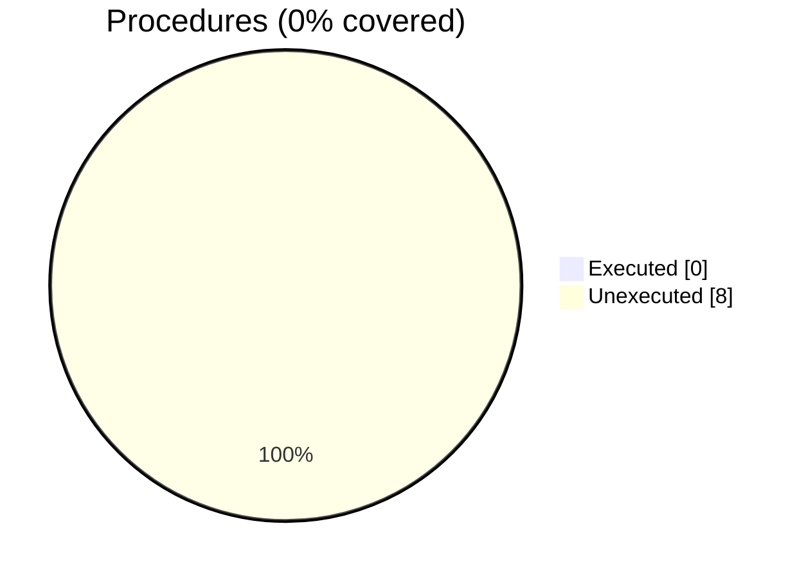

### Coverage analysis of *penf.F90*

|Lines| | |
| --- | --- | --- |
|Executable lines            |80| |
|Executed lines              |0|0%|
|Unexecuted lines            |80|100%|
|Average hits / executed     |0| |

|Procedures| | |
| --- | --- | --- |
|Total procedures            |8| |
|Executed procedures         |0|0%|
|Unexecuted procedures       |8|100%|
|Average hits / executed     |0| |

#### Unexecuted procedures

 + *function* **digit_I1**, line 230
 + *function* **digit_I2**, line 214
 + *function* **digit_I4**, line 198
 + *function* **digit_I8**, line 182
 + *function* **is_little_endian**, line 82
 + *subroutine* **check_endian**, line 65
 + *subroutine* **penf_init**, line 92
 + *subroutine* **penf_print**, line 106

#### Executed procedures

 + *none*

 --- 
 Report generated by [FoBiS.py](https://github.com/szaghi/FoBiS)