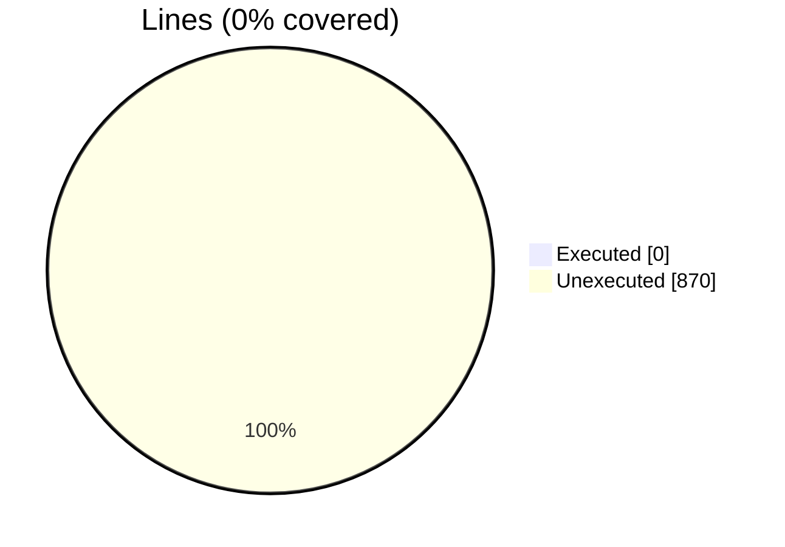
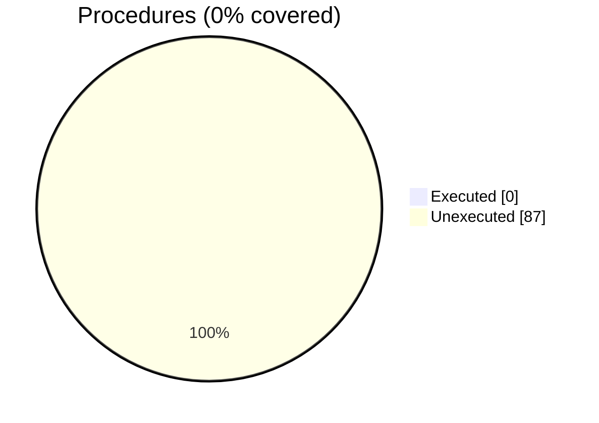

### Coverage analysis of *penf_allocatable_memory.F90*

|Lines| | |
| --- | --- | --- |
|Executable lines            |870| |
|Executed lines              |0|0%|
|Unexecuted lines            |870|100%|
|Average hits / executed     |0| |

|Procedures| | |
| --- | --- | --- |
|Total procedures            |87| |
|Executed procedures         |0|0%|
|Unexecuted procedures       |87|100%|
|Average hits / executed     |0| |

#### Unexecuted procedures

 + *subroutine* **alloc_var_I1P_1D**, line 1904
 + *subroutine* **alloc_var_I1P_2D**, line 1942
 + *subroutine* **alloc_var_I1P_3D**, line 1982
 + *subroutine* **alloc_var_I1P_4D**, line 2023
 + *subroutine* **alloc_var_I1P_5D**, line 2065
 + *subroutine* **alloc_var_I1P_6D**, line 2108
 + *subroutine* **alloc_var_I1P_7D**, line 2152
 + *subroutine* **alloc_var_I2P_1D**, line 1609
 + *subroutine* **alloc_var_I2P_2D**, line 1647
 + *subroutine* **alloc_var_I2P_3D**, line 1687
 + *subroutine* **alloc_var_I2P_4D**, line 1728
 + *subroutine* **alloc_var_I2P_5D**, line 1770
 + *subroutine* **alloc_var_I2P_6D**, line 1813
 + *subroutine* **alloc_var_I2P_7D**, line 1857
 + *subroutine* **alloc_var_I4P_1D**, line 1314
 + *subroutine* **alloc_var_I4P_2D**, line 1352
 + *subroutine* **alloc_var_I4P_3D**, line 1392
 + *subroutine* **alloc_var_I4P_4D**, line 1433
 + *subroutine* **alloc_var_I4P_5D**, line 1475
 + *subroutine* **alloc_var_I4P_6D**, line 1518
 + *subroutine* **alloc_var_I4P_7D**, line 1562
 + *subroutine* **alloc_var_I8P_1D**, line 1019
 + *subroutine* **alloc_var_I8P_2D**, line 1057
 + *subroutine* **alloc_var_I8P_3D**, line 1097
 + *subroutine* **alloc_var_I8P_4D**, line 1138
 + *subroutine* **alloc_var_I8P_5D**, line 1180
 + *subroutine* **alloc_var_I8P_6D**, line 1223
 + *subroutine* **alloc_var_I8P_7D**, line 1267
 + *subroutine* **alloc_var_R4P_1D**, line 724
 + *subroutine* **alloc_var_R4P_2D**, line 762
 + *subroutine* **alloc_var_R4P_3D**, line 802
 + *subroutine* **alloc_var_R4P_4D**, line 843
 + *subroutine* **alloc_var_R4P_5D**, line 885
 + *subroutine* **alloc_var_R4P_6D**, line 928
 + *subroutine* **alloc_var_R4P_7D**, line 972
 + *subroutine* **alloc_var_R8P_1D**, line 429
 + *subroutine* **alloc_var_R8P_2D**, line 467
 + *subroutine* **alloc_var_R8P_3D**, line 507
 + *subroutine* **alloc_var_R8P_4D**, line 548
 + *subroutine* **alloc_var_R8P_5D**, line 590
 + *subroutine* **alloc_var_R8P_6D**, line 633
 + *subroutine* **alloc_var_R8P_7D**, line 677
 + *subroutine* **assign_allocatable_I1P_1D**, line 3538
 + *subroutine* **assign_allocatable_I1P_2D**, line 3565
 + *subroutine* **assign_allocatable_I1P_3D**, line 3595
 + *subroutine* **assign_allocatable_I1P_4D**, line 3626
 + *subroutine* **assign_allocatable_I1P_5D**, line 3658
 + *subroutine* **assign_allocatable_I1P_6D**, line 3691
 + *subroutine* **assign_allocatable_I1P_7D**, line 3725
 + *subroutine* **assign_allocatable_I2P_1D**, line 3315
 + *subroutine* **assign_allocatable_I2P_2D**, line 3342
 + *subroutine* **assign_allocatable_I2P_3D**, line 3372
 + *subroutine* **assign_allocatable_I2P_4D**, line 3403
 + *subroutine* **assign_allocatable_I2P_5D**, line 3435
 + *subroutine* **assign_allocatable_I2P_6D**, line 3468
 + *subroutine* **assign_allocatable_I2P_7D**, line 3502
 + *subroutine* **assign_allocatable_I4P_1D**, line 3092
 + *subroutine* **assign_allocatable_I4P_2D**, line 3119
 + *subroutine* **assign_allocatable_I4P_3D**, line 3149
 + *subroutine* **assign_allocatable_I4P_4D**, line 3180
 + *subroutine* **assign_allocatable_I4P_5D**, line 3212
 + *subroutine* **assign_allocatable_I4P_6D**, line 3245
 + *subroutine* **assign_allocatable_I4P_7D**, line 3279
 + *subroutine* **assign_allocatable_I8P_1D**, line 2869
 + *subroutine* **assign_allocatable_I8P_2D**, line 2896
 + *subroutine* **assign_allocatable_I8P_3D**, line 2926
 + *subroutine* **assign_allocatable_I8P_4D**, line 2957
 + *subroutine* **assign_allocatable_I8P_5D**, line 2989
 + *subroutine* **assign_allocatable_I8P_6D**, line 3022
 + *subroutine* **assign_allocatable_I8P_7D**, line 3056
 + *subroutine* **assign_allocatable_R4P_1D**, line 2646
 + *subroutine* **assign_allocatable_R4P_2D**, line 2673
 + *subroutine* **assign_allocatable_R4P_3D**, line 2703
 + *subroutine* **assign_allocatable_R4P_4D**, line 2734
 + *subroutine* **assign_allocatable_R4P_5D**, line 2766
 + *subroutine* **assign_allocatable_R4P_6D**, line 2799
 + *subroutine* **assign_allocatable_R4P_7D**, line 2833
 + *subroutine* **assign_allocatable_R8P_1D**, line 2423
 + *subroutine* **assign_allocatable_R8P_2D**, line 2450
 + *subroutine* **assign_allocatable_R8P_3D**, line 2480
 + *subroutine* **assign_allocatable_R8P_4D**, line 2511
 + *subroutine* **assign_allocatable_R8P_5D**, line 2543
 + *subroutine* **assign_allocatable_R8P_6D**, line 2576
 + *subroutine* **assign_allocatable_R8P_7D**, line 2610
 + *subroutine* **get_memory_info**, line 3761
 + *subroutine* **parse_line**, line 3809
 + *subroutine* **save_memory_status**, line 3823

#### Executed procedures

 + *none*

 --- 
 Report generated by [FoBiS.py](https://github.com/szaghi/FoBiS)