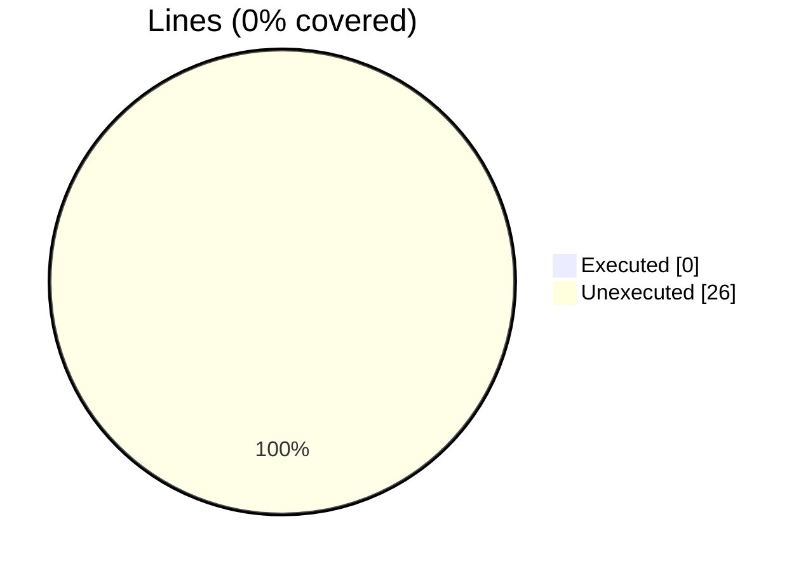
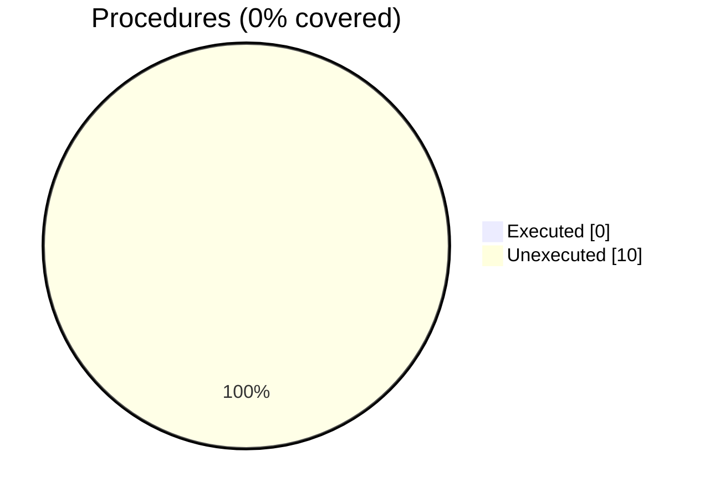

### Coverage analysis of *penf_b_size.F90*

|Lines| | |
| --- | --- | --- |
|Executable lines            |26| |
|Executed lines              |0|0%|
|Unexecuted lines            |26|100%|
|Average hits / executed     |0| |

|Procedures| | |
| --- | --- | --- |
|Total procedures            |10| |
|Executed procedures         |0|0%|
|Unexecuted procedures       |10|100%|
|Average hits / executed     |0| |

#### Unexecuted procedures

 + *function* **bit_size_R4P**, line 69
 + *function* **bit_size_R8P**, line 54
 + *function* **bit_size_chr**, line 84
 + *function* **byte_size_I1P**, line 197
 + *function* **byte_size_I2P**, line 183
 + *function* **byte_size_I4P**, line 169
 + *function* **byte_size_I8P**, line 155
 + *function* **byte_size_R4P**, line 127
 + *function* **byte_size_R8P**, line 113
 + *function* **byte_size_chr**, line 141

#### Executed procedures

 + *none*

 --- 
 Report generated by [FoBiS.py](https://github.com/szaghi/FoBiS)