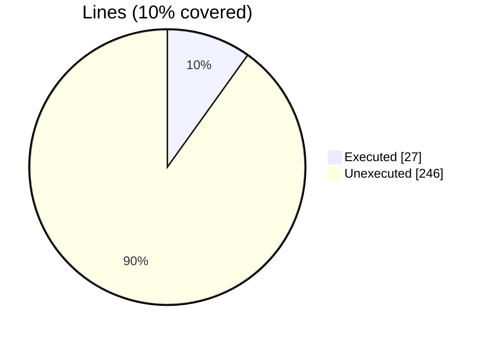
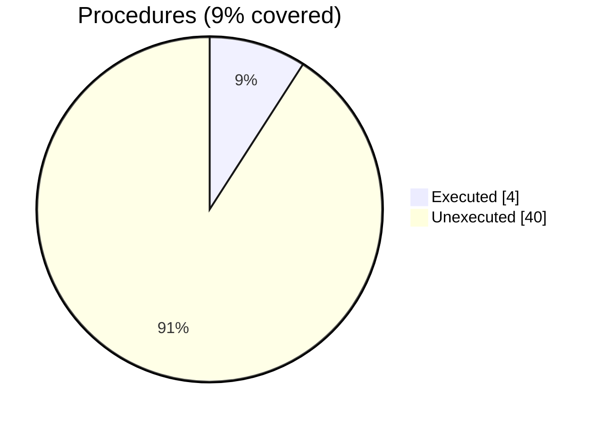

### Coverage analysis of *penf_stringify.F90*

|Lines| | |
| --- | --- | --- |
|Executable lines            |273| |
|Executed lines              |27|10%|
|Unexecuted lines            |246|90%|
|Average hits / executed     |636385.7777777778| |

|Procedures| | |
| --- | --- | --- |
|Total procedures            |44| |
|Executed procedures         |4|9%|
|Unexecuted procedures       |40|91%|
|Average hits / executed     |712701.0| |

#### Unexecuted procedures

 + *function* **bctoi_I1P**, line 1432
 + *function* **bctoi_I2P**, line 1417
 + *function* **bctoi_I4P**, line 1402
 + *function* **bctoi_I8P**, line 1387
 + *function* **bctor_R4P**, line 1370
 + *function* **bctor_R8P**, line 1353
 + *function* **bstr_I1P**, line 1319
 + *function* **bstr_I2P**, line 1303
 + *function* **bstr_I4P**, line 1287
 + *function* **bstr_I8P**, line 1271
 + *function* **bstr_R4P**, line 1253
 + *function* **bstr_R8P**, line 1235
 + *function* **ctoi_I1P**, line 1191
 + *function* **ctoi_I2P**, line 1167
 + *function* **ctoi_I4P**, line 1143
 + *function* **ctoi_I8P**, line 1119
 + *function* **ctor_R4P**, line 1095
 + *function* **ctor_R8P**, line 1071
 + *function* **str_I1P**, line 482
 + *function* **str_I2P**, line 458
 + *function* **str_I8P**, line 410
 + *function* **str_R4P**, line 377
 + *function* **str_a_I1P**, line 838
 + *function* **str_a_I2P**, line 785
 + *function* **str_a_I4P**, line 732
 + *function* **str_a_I8P**, line 679
 + *function* **str_a_R4P**, line 626
 + *function* **str_ascii_default**, line 110
 + *function* **str_bol**, line 506
 + *function* **str_ucs4_default**, line 158
 + *function* **strf_I1P**, line 296
 + *function* **strf_I2P**, line 281
 + *function* **strf_I4P**, line 266
 + *function* **strf_I8P**, line 251
 + *function* **strf_R4P**, line 236
 + *function* **strf_R8P**, line 221
 + *function* **strz_I1P**, line 1024
 + *function* **strz_I2P**, line 1001
 + *function* **strz_I8P**, line 955
 + *subroutine* **compact_real_string**, line 891

#### Executed procedures

 + *function* **str_R8P**: tested **2843890** times
 + *function* **str_a_R8P**: tested **6500** times
 + *function* **strz_I4P**: tested **408** times
 + *function* **str_I4P**: tested **6** times

 --- 
 Report generated by [FoBiS.py](https://github.com/szaghi/FoBiS)