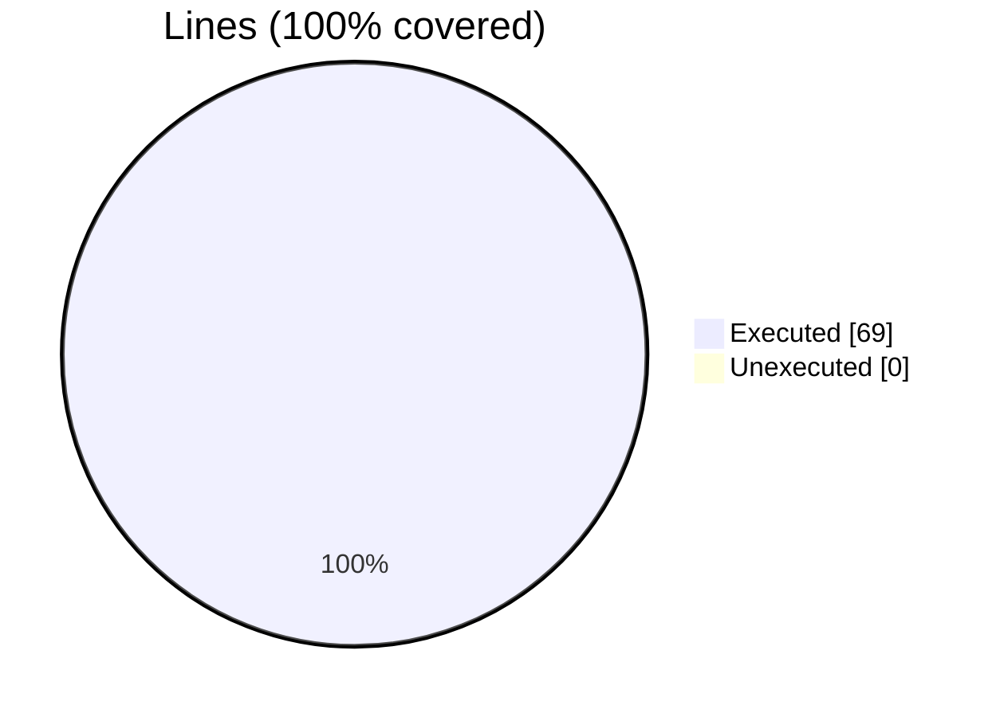
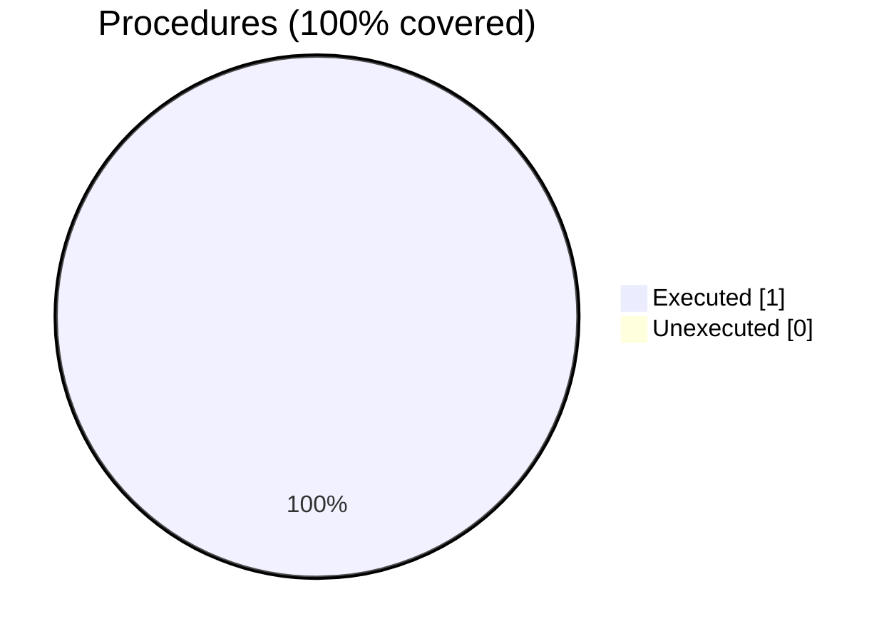

### Coverage analysis of *test_fdv_divergence_trigonometric.F90*

|Lines| | |
| --- | --- | --- |
|Executable lines            |69| |
|Executed lines              |69|100%|
|Unexecuted lines            |0|0%|
|Average hits / executed     |26824.521739130436| |

|Procedures| | |
| --- | --- | --- |
|Total procedures            |1| |
|Executed procedures         |1|100%|
|Unexecuted procedures       |0|0%|
|Average hits / executed     |10.0| |

#### Unexecuted procedures

 + *none*

#### Executed procedures

 + *subroutine* **save_file**: tested **10** times

 --- 
 Report generated by [FoBiS.py](https://github.com/szaghi/FoBiS)