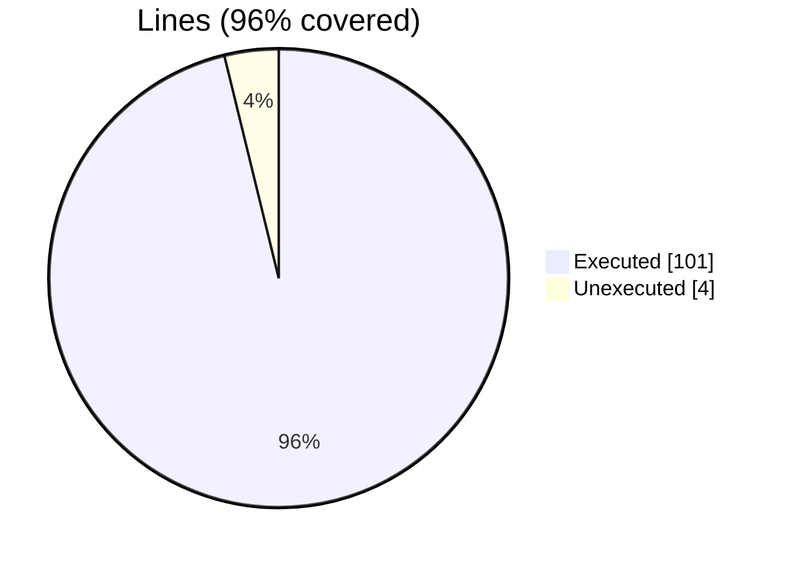
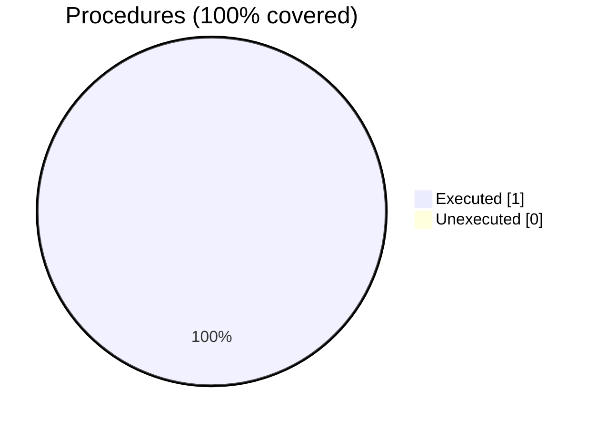

### Coverage analysis of *test_fdv_operators_trigonometric.F90*

|Lines| | |
| --- | --- | --- |
|Executable lines            |105| |
|Executed lines              |101|96%|
|Unexecuted lines            |4|4%|
|Average hits / executed     |723.4059405940594| |

|Procedures| | |
| --- | --- | --- |
|Total procedures            |1| |
|Executed procedures         |1|100%|
|Unexecuted procedures       |0|0%|
|Average hits / executed     |51.0| |

#### Unexecuted procedures

 + *none*

#### Executed procedures

 + *subroutine* **save_file**: tested **51** times

 --- 
 Report generated by [FoBiS.py](https://github.com/szaghi/FoBiS)