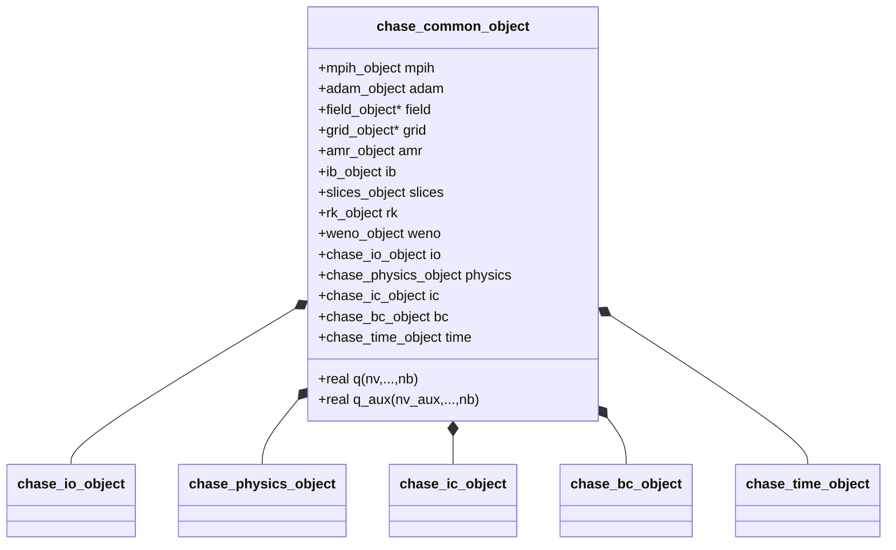

# CHASE — Common

> Backend-independent modules shared by all CHASE backends.

The `common/` directory contains the base object and all CHASE-specific
handler types. Every backend extends `chase_common_object` and reuses
these modules unchanged.

## Source layout

| Source file | Module | Role |
|-------------|--------|------|
| `adam_chase_common_object.F90` | `adam_chase_common_object` | Base object — ADAM SDK + CHASE handler composition |
| `adam_chase_physics_object.F90` | `adam_chase_physics_object` | Fluid physics — EOS, variable layout, flux procedures |
| `adam_chase_parameters.F90` | `adam_chase_parameters` | Physical constants and eigenvector matrices |
| `adam_chase_bc_object.F90` | `adam_chase_bc_object` | Boundary conditions handler |
| `adam_chase_ic_object.F90` | `adam_chase_ic_object` | Initial conditions handler |
| `adam_chase_io_object.F90` | `adam_chase_io_object` | IO handler — XH5F output, restart, residuals |
| `adam_chase_time_object.F90` | `adam_chase_time_object` | Time state and integration parameters |
| `adam_chase_riemann_library.F90` | `adam_chase_riemann_library` | Riemann solvers and Maxwell flux functions |
| `adam_chase_common_library.F90` | `adam_chase_common_library` | Barrel re-export of all common modules |

---

## `chase_common_object`

Non-extending base type that aggregates all ADAM SDK objects and CHASE-specific
handlers. Backend objects (e.g. `chase_cpu_object`) extend this type and
provide the numerical methods.

### Composition



### Data members

| Member | Type | Description |
|--------|------|-------------|
| `mpih` | `mpih_object` | MPI handler |
| `adam` | `adam_object` | ADAM SDK — grid, tree, field, AMR, IO |
| `field` | `field_object*` | Field variable storage and ghost-cell maps (pointer into `adam`) |
| `grid` | `grid_object*` | Structured block grid (pointer into `adam`) |
| `amr` | `amr_object` | AMR marker handler |
| `ib` | `ib_object` | Immersed Boundary handler |
| `slices` | `slices_object` | Slice sampling for scheduled output |
| `rk` | `rk_object` | Runge-Kutta integrator |
| `weno` | `weno_object` | WENO reconstructor |
| `io` | `chase_io_object` | IO configuration and file handles |
| `physics` | `chase_physics_object` | EOS and WENO projection basis |
| `ic` | `chase_ic_object` | Initial conditions |
| `bc` | `chase_bc_object` | Boundary conditions |
| `time` | `chase_time_object` | Time state and parameters |
| `ngc, ni, nj, nk, nb` | `integer*` | Grid dimension pointers |
| `blocks_number, nv, nv_aux` | `integer*` | Size pointers |
| `q` | `real(R8P)(nv, 1-ngc:ni+ngc, …, nb)` | Conservative variables |
| `q_aux` | `real(R8P)(nv_aux, 1-ngc:ni+ngc, …, nb)` | Auxiliary variables |
| `q_name` | `character(2)(nv)` | Variable names: `r ru rv rw rE` |

### `initialize_common(field, filename, …)`

Initialisation sequence:

```
mpih%initialize         ! MPI init
io%initialize           ! parse INI file
bc%initialize           ! read BC config
physics%initialize      ! EOS + WENO basis
adam%grid%initialize    ! build structured grid
adam%compute_blocks_number
adam%initialize         ! tree + maps + field
adam%refine_uniform     ! initial uniform refinement
adam%prune              ! tree pruning
amr%initialize
time%initialize
ic%initialize
ib%initialize
slices%initialize
rk%initialize
weno%initialize
allocate_common         ! allocate q_aux
adam%io%initialize      ! register output variables
```

Output variable names registered with ADAM IO:
`r_a u_a v_a w_a p_a a_a T_a E_a H_a Rfa g_a`.

---

## `chase_physics_object`

Encapsulates the ideal-gas equation of state and the WENO reconstruction basis
selection. Also exports three pure elemental procedures used directly in the
compute kernel loop.

### Variable layout

| Array | Index | Symbol | Description |
|-------|-------|--------|-------------|
| `q` (conservative) | 1 | $\rho$ | Density |
| | 2 | $\rho u$ | x-momentum |
| | 3 | $\rho v$ | y-momentum |
| | 4 | $\rho w$ | z-momentum |
| | 5 | $\rho E$ | Total energy |
| `q_aux` (auxiliary) | 1 | $\rho$ | Density |
| | 2 | $u$ | x-velocity |
| | 3 | $v$ | y-velocity |
| | 4 | $w$ | z-velocity |
| | 5 | $p$ | Pressure |
| | 6 | $T$ | Temperature |
| | 7 | $E$ | Total specific energy |
| | 8 | $H$ | Total specific enthalpy |
| | 9 | $a$ | Speed of sound |
| | 10 | $R_f = c_p - c_v$ | Fluid constant |
| | 11 | $\gamma = c_p/c_v$ | Specific heats ratio |

Named index constants (e.g. `VAR_R=1`, `VAR_RU=2`, …, `VAR_G=11`) are
exported as public parameters.

### Key data members

| Member | Default | Description |
|--------|---------|-------------|
| `nv` | 5 | Conservative variable count |
| `nv_aux` | 11 | Auxiliary variable count |
| `eos` | — | `eos_ic_object` — ideal-gas: R, cv, g, mu, delta, gm1 |
| `weno_rec_var` | — | `'CONSERVATIVE'` or `'CHARACTERISTICS'` |
| `erw`, `elw` | — | Right/left eigenvector matrix pointers for WENO projection |

**WENO reconstruction basis** (INI section `[physics]`, key `weno_rec_var`):

| Value | Matrix used | Description |
|-------|-------------|-------------|
| `CONSERVATIVE` | `IERL` (identity, 6×6×3) | Reconstruct conservative variables directly |
| `CHARACTERISTICS` | `ER` / `EL` (6×6×3) | Project to characteristics before reconstruction |

### Module-level procedures

| Procedure | Description |
|-----------|-------------|
| `compute_auxiliary(cv, Rf, g, conservative, auxiliary)` | Single-cell conservative → auxiliary; derives $p = R_f \rho T$, $a = \sqrt{\gamma R_f T}$, $H = E + R_f T$ |
| `compute_conservative(auxiliary, conservative)` | Single-cell auxiliary → conservative: $\rho E = \rho H - p$ |
| `compute_fluxes_conservative(sir, auxiliary, fluxes)` | Single-cell Euler flux vector in direction `sir`; $F_1 = \rho \mathbf{u} \cdot \hat{s}$, $F_5 = F_1 H$ |

---

## `adam_chase_parameters`

Global physical constants and precomputed eigenvector matrices. All symbols
are `public` module-level entities.

### Physical constants

| Parameter | Value | Description |
|-----------|-------|-------------|
| `NV_MAX` | 11 | Maximum variable count for static array sizing |
| `MU0` | 1.256637×10⁻⁶ | Vacuum magnetic permeability $\mu_0$ (H m⁻¹) |
| `EPS0` | 8.854187×10⁻¹² | Vacuum permittivity $\varepsilon_0$ (F m⁻¹) |
| `C0` | $1/\sqrt{\mu_0 \varepsilon_0}$ | Vacuum speed of light $c_0$ (m s⁻¹) |
| `PI` | 3.14159… | $\pi$ |
| `E_CHARGE` | −1.6×10⁻¹⁹ | Electron charge (C) |
| `E_MASS` | 9.11×10⁻³¹ | Electron mass (kg) |
| `K_B` | 1.380649×10⁻²³ | Boltzmann constant (J K⁻¹) |

### Eigenvector matrices

Pre-built for characteristic-based WENO projection on a 6-component system.

| Symbol | Shape | Description |
|--------|-------|-------------|
| `EV(6)` | `[0,0,c₀,c₀,−c₀,−c₀]` | Eigenvalues (electromagnetic wave speeds) |
| `ER(6,6,3)` | 6×6×3 | Right eigenvectors per direction |
| `EL(6,6,3)` | 6×6×3 | Left eigenvectors per direction |
| `IEV(6)` | `[1,1,1,1,1,1]` | Identity eigenvalues |
| `IERL(6,6,3)` | 6×6×3 | Identity eigenvectors (no projection) |

---

## `chase_bc_object`

Reads and stores boundary conditions for all 6 domain faces.

### BC types

| Constant | Value | INI keyword | Description |
|----------|-------|-------------|-------------|
| `BC_EXTRAPOLATION` | 1 | `extrapolation` | Zero-order extrapolation into ghost cells |
| `BC_INFLOW` | 2 | `inflow` | Supersonic inflow — prescribed primitive state |
| `BC_WALL_INVISCID` | 3 | `wall-inviscid` | Slip wall (normal velocity reflected) |

### INI configuration

One section per face: `[bc_x_min]`, `[bc_x_max]`, `[bc_y_min]`, `[bc_y_max]`,
`[bc_z_min]`, `[bc_z_max]`.

```ini
[bc_x_min]
type = extrapolation

[bc_x_max]
type = inflow
r  = 1.0     ; density
u  = 2.0     ; x-velocity
v  = 0.0     ; y-velocity
w  = 0.0     ; z-velocity
p  = 1.0     ; pressure
s  = 0.0     ; perturbation seed

[bc_y_min]
type = wall-inviscid
```

The inflow state `q(:, face)` stores `(r, u, v, w, p, s)` — 6 values per face.
`s` is a perturbation amplitude used by the IC module.

### Data members

| Member | Description |
|--------|-------------|
| `bc_type(6)` | BC type integer per face |
| `q(6, 6)` | Primitive state `(r,u,v,w,p,s)` for each face |

---

## `chase_ic_object`

Sets initial conditions at simulation start and after each AMR adaptation pass.

### IC types

| Constant | INI keyword | Description |
|----------|-------------|-------------|
| `IC_TYPE_UNIFORM` | `uniform` | Constant $(\rho, u, v, w, p)$ with optional random velocity perturbation $\delta u \in [0, q_6]$ |
| `IC_TYPE_IVORTEX` | `isentropic-vortex` | Analytical isentropic vortex; $q_6$ = radius, `emin(x,y)` = centre coordinates |
| `IC_TYPE_RP` | `riemann-problem` | Piecewise constant regions; each box defined by `[emin, emax]` in 3D |

### INI configuration

```ini
[initial_conditions]
amr_iterations = 2
type           = riemann-problem
regions_number = 2

[initial_conditions_region_1]
r      = 1.0
u      = 0.0
v      = 0.0
w      = 0.0
p      = 1.0
s      = 0.0
emin_x = -1.0  ;  emin_y = -1.0  ;  emin_z = -1.0
emax_x =  0.0  ;  emax_y =  1.0  ;  emax_z =  1.0

[initial_conditions_region_2]
r      = 0.125
u      = 0.0
; ...
emin_x =  0.0  ;  ...  ;  emax_x = 1.0  ;  ...
```

`amr_iterations` controls how many AMR + IC cycles to run before the final
initial condition is applied on the converged grid.

---

## `chase_io_object`

Manages file I/O scheduling, file handles, and residuals output.

### Data members

| INI option (`[IO]`) | Default | Description |
|--------------------|---------|-------------|
| `it_save` | 100 | Main XH5F snapshot frequency (every N steps) |
| `output_basename` | — | Basename for XH5F output files |
| `restart` | `.false.` | Enable restart from checkpoint |
| `restart_basename` | — | Basename for restart files |
| `restart_save` | 100 | Restart checkpoint frequency (every N steps) |
| `save_memory_status` | `.false.` | Log memory usage during allocation |
| `residuals_save` | 10 | Residuals norm output frequency (every N steps) |

### Methods

| Procedure | Description |
|-----------|-------------|
| `open_file_residuals` | Opens residuals text file at `output_basename.res` |
| `close_file_residuals` | Closes the residuals file |
| `save_residuals(it, time, blocks_number, residuals)` | Appends one line: step, time, per-variable L2 norms |

---

## `chase_time_object`

Tracks simulation time and provides the termination check.

### Data members

| INI option (`[time]`) | Default | Description |
|----------------------|---------|-------------|
| `it_max` | −1 | Maximum time steps (−1 = ignore) |
| `time_max` | 1.0 | Maximum simulation time |
| `CFL` | 0.3 | CFL stability coefficient |
| `it` | 0 | Current time step counter |
| `time` | 0.0 | Current simulation time |
| `dt` | 0.0001 | Current time step (updated each step) |

### Termination criteria

`is_to_save(it_save)` returns `.true.` when any of:

| Criterion | Condition |
|-----------|-----------|
| Periodic output | `mod(it, it_save) == 0` |
| Step limit | `it_max > 0` and `it >= it_max` |
| Time limit | `it_max <= 0` and `time >= time_max` |

---

## `adam_chase_riemann_library`

Riemann solver library for Maxwell's equations and related flux functions.

### Public procedures

| Procedure | Description |
|-----------|-------------|
| `compute_riemann_maxwell_llf(sir, nv, q1, q4, f [,lmax])` | LLF (Rusanov) solver; wave speed fixed at $c_0 = 1/\sqrt{\mu_0 \varepsilon_0}$ |
| `compute_riemann_maxwell_hll(sir, nv, q1, q4, f [,lmax, lmin])` | HLL solver; $\lambda_{\max} = +c_0$, $\lambda_{\min} = -c_0$ |
| `compute_convective_fluxes_maxwell(sir, q, f)` | Maxwell flux vector in direction `sir` |
| `compute_convective_fluxes_maxwell_div_d(sir, q, f)` | Maxwell flux with $\nabla \cdot \mathbf{D}$ divergence cleaning |
| `compute_convective_fluxes_maxwell_div_d_b(sir, q, f)` | Maxwell flux with $\nabla \cdot \mathbf{D}$ and $\nabla \cdot \mathbf{B}$ cleaning |

> **Note**: This module is **not** included in `adam_chase_common_library` and must
> be used explicitly by any backend that requires it.

---

## `adam_chase_common_library`

Barrel re-export module. A single `use adam_chase_common_library` brings all
common handler modules into scope:

```fortran
use adam_chase_bc_object
use adam_chase_common_object
use adam_chase_ic_object
use adam_chase_io_object
use adam_chase_parameters
use adam_chase_physics_object
use adam_chase_time_object
```

> `adam_chase_riemann_library` is intentionally excluded — backends use it
> directly when needed.

---

## Copyrights

CHASE is part of the ADAM framework, released under the
[GNU Lesser General Public License v3.0](https://www.gnu.org/licenses/lgpl-3.0.html)
(LGPLv3).

> Copyright (C) Andrea Di Mascio, Federico Negro, Giacomo Rossi, Francesco Salvadore, Stefano Zaghi.
