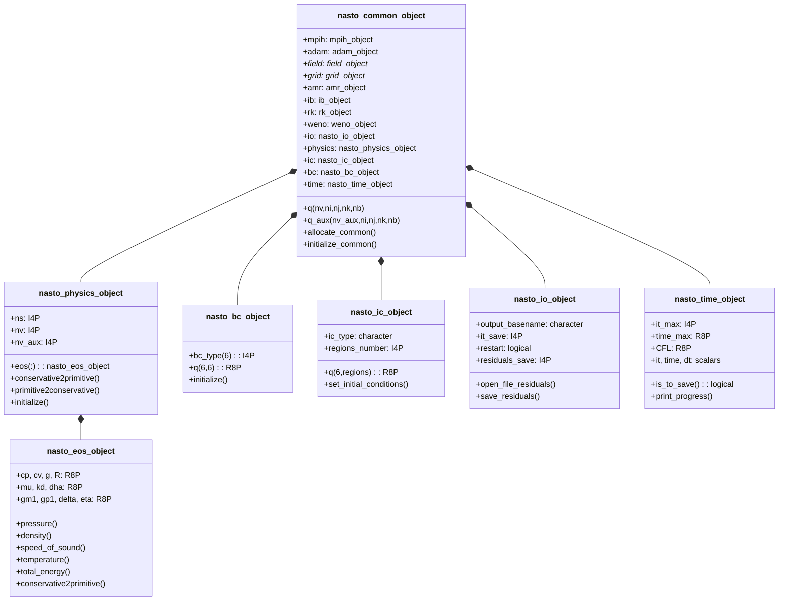

# NASTO — Common

> Backend-independent physics, configuration, and I/O layer for all NASTO solvers.

The `common/` directory provides the objects shared by every NASTO backend
(CPU, NVF, FNL, GMP). It covers the full simulation lifecycle — configuration
parsing, equation of state, initial and boundary conditions, time-step control,
and I/O — without containing any backend-specific compute kernels.

## Module overview

| Source file | Module | Type | Role |
|-------------|--------|------|------|
| `adam_nasto_parameters.F90` | `adam_nasto_parameters` | — | Global parameter placeholder |
| `adam_nasto_common_object.F90` | `adam_nasto_common_object` | `nasto_common_object` | Central orchestrator; extended by every backend |
| `adam_nasto_physics_object.F90` | `adam_nasto_physics_object` | `nasto_physics_object` | Species count and variable-index management |
| `adam_nasto_eos_object.F90` | `adam_nasto_eos_object` | `nasto_eos_object` | Ideal-gas equation of state per species |
| `adam_nasto_bc_object.F90` | `adam_nasto_bc_object` | `nasto_bc_object` | Boundary condition types and inflow data |
| `adam_nasto_ic_object.F90` | `adam_nasto_ic_object` | `nasto_ic_object` | Initial condition setup (uniform, vortex, Riemann) |
| `adam_nasto_io_object.F90` | `adam_nasto_io_object` | `nasto_io_object` | Output frequency, restart, residual monitoring |
| `adam_nasto_time_object.F90` | `adam_nasto_time_object` | `nasto_time_object` | CFL time-step control and termination criteria |
| `adam_nasto_common_library.F90` | `adam_nasto_common_library` | — | Barrel re-export of all modules above |

## Object hierarchy



---

## `nasto_common_object`

The top-level base class. Every backend object (`nasto_cpu_object`,
`nasto_nvf_object`, etc.) **extends** this type, inheriting all handlers and
grid/field references without duplicating configuration logic.

### Data members

**ADAM SDK objects** (aggregated, not inherited):

| Member | Type | Purpose |
|--------|------|---------|
| `mpih` | `mpih_object` | MPI communication handler |
| `adam` | `adam_object` | Top-level ADAM framework |
| `field` | `field_object*` | 5D field array container |
| `grid` | `grid_object*` | Block-structured grid geometry |
| `amr` | `amr_object` | AMR marker and refinement handler |
| `ib` | `ib_object` | Immersed boundary method |
| `slices` | `slices_object` | In-situ slice output |
| `rk` | `rk_object` | Runge-Kutta temporal integrator |
| `weno` | `weno_object` | WENO reconstruction |

**NASTO handlers**:

| Member | Type | Purpose |
|--------|------|---------|
| `io` | `nasto_io_object` | Output and restart control |
| `physics` | `nasto_physics_object` | Species and thermodynamics |
| `ic` | `nasto_ic_object` | Initial condition setup |
| `bc` | `nasto_bc_object` | Boundary conditions |
| `time` | `nasto_time_object` | Time-step and termination |

**Field arrays** (allocated with ghost cells):

```fortran
real(R8P), allocatable :: q    (nv,     1-ngc:ni+ngc, 1-ngc:nj+ngc, 1-ngc:nk+ngc, nb)
real(R8P), allocatable :: q_aux(nv_aux, 1-ngc:ni+ngc, 1-ngc:nj+ngc, 1-ngc:nk+ngc, nb)
```

`q` holds conservative variables; `q_aux` holds primitive/auxiliary variables
(density, velocity components, pressure, temperature, etc.).

### Methods

| Procedure | Purpose |
|-----------|---------|
| `allocate_common()` | Allocates `q` and `q_aux` with correct ghost-cell bounds |
| `initialize_common()` | Full startup sequence: MPI → IO → physics → grid → AMR → fields → IC → BC → time → WENO → IB |

---

## `nasto_physics_object`

Manages the number of fluid species and the mapping between species and
conservative-variable indices.

### Data members

| Member | Type | Default | Description |
|--------|------|---------|-------------|
| `ns` | `I4P` | 1 | Number of fluid species |
| `nv` | `I4P` | 5 | Conservative variables = `ns + 4` (momentum + energy) |
| `nv_aux` | `I4P` | 9 | Auxiliary variables = `ns + 8` |
| `np` | `I4P` | 5 | 1D primitive variables = `ns + 4` |
| `eos(:)` | `nasto_eos_object` | — | EOS model for each species `[1:ns]` |

**Variable index offsets** (module-level, computed after `initialize()`):

| Index | Meaning |
|-------|---------|
| `IR = ns + 1` | Bulk density in `q_aux` |
| `IU = ns + 2` | x-velocity |
| `IV = ns + 3` | y-velocity |
| `IW = ns + 4` | z-velocity |
| `IG = ns + 5` | Heat capacity ratio γ |
| `IP = ns + 6` | Pressure |

### Methods

| Procedure | Notes |
|-----------|-------|
| `initialize()` | Reads `ns` from INI; allocates `eos(1:ns)`; updates index offsets |
| `conservative2primitive()` | Pure: `(ρs, ρu, ρv, ρw, ρE) → (s, u, v, w, ρ, p, γ)` |
| `primitive2conservative()` | Pure: inverse conversion |
| `description()` | Formatted summary string |

### INI configuration

```ini
[physics]
  ns = 1          ! number of fluid species
```

---

## `nasto_eos_object`

Ideal-gas equation of state for a single fluid species. Stores primary
thermodynamic properties and pre-computes derived combinations for efficiency.

### Data members

| Member | Type | Description |
|--------|------|-------------|
| `cp` | `R8P` | Specific heat at constant pressure (J/kg·K) |
| `cv` | `R8P` | Specific heat at constant volume (J/kg·K) |
| `g` | `R8P` | Heat capacity ratio γ = cp/cv |
| `R` | `R8P` | Gas constant = cp − cv (J/kg·K) |
| `mu` | `R8P` | Dynamic viscosity (Pa·s) |
| `kd` | `R8P` | Thermal diffusivity (W/m·K) |
| `dha` | `R8P` | Enthalpy of formation (J/kg) |
| `gm1` | `R8P` | γ − 1 (pre-computed) |
| `gp1` | `R8P` | γ + 1 (pre-computed) |
| `delta` | `R8P` | (γ − 1)/2 |
| `eta` | `R8P` | 2γ/(γ − 1) |

### Methods

**Elemental state functions** (vectorise over arrays):

| Procedure | Returns |
|-----------|---------|
| `pressure(ρ, e)` | $p = (\gamma-1)\,\rho\,e$ |
| `density(p, c)` | $\rho = \gamma\,p/c^2$ |
| `speed_of_sound(ρ, p)` | $c = \sqrt{\gamma\,p/\rho}$ |
| `temperature(ρ, p)` | $T = p/(\rho R)$ |
| `internal_energy(ρ, p)` | $e = p/[(\gamma-1)\rho]$ |
| `total_energy(ρ, u, v, w, p)` | $E = e + \tfrac{1}{2}(u^2+v^2+w^2)$ |
| `total_entalpy(ρ, u, v, w, p)` | $H = E + p/\rho$ |

**Other methods**:

| Procedure | Purpose |
|-----------|---------|
| `compute_derivate()` | Derives `gm1`, `gp1`, `delta`, `eta` from `cp`/`cv` |
| `conservative2primitive()` | Single-species conversion |
| `load_from_file()` | Reads properties from INI |
| `save_into_file()` | Writes properties back to INI |
| `destroy()` | Resets to default state |

### INI configuration

Section name: `physics_specie_N` where N is the species index (1-based).

```ini
[physics_specie_1]
  cp  = 1004.5      ! J/kg·K
  cv  = 717.5       ! J/kg·K
  mu  = 1.8e-5      ! Pa·s
  kd  = 0.026       ! W/m·K
  dha = 0.0         ! J/kg  (enthalpy of formation)
```

---

## `nasto_bc_object`

Stores the boundary condition type for each of the six domain faces and the
prescribed primitive-variable state for inflow boundaries.

### Boundary condition types

| Constant | Value | Description |
|----------|-------|-------------|
| `BC_EXTRAPOLATION` | 1 | Zero-gradient extrapolation (outflow) |
| `BC_INFLOW` | 2 | Supersonic inflow with prescribed (ρ, u, v, w, p) |
| `BC_WALL_INVISCID` | 3 | Slip wall — normal velocity set to zero |

Face ordering in `bc_type(6)`: x_min, x_max, y_min, y_max, z_min, z_max.

### INI configuration

```ini
[bc_x_min]
  type = inflow
  r = 1.225       ! density (kg/m³)
  u = 340.0       ! x-velocity (m/s)
  v = 0.0
  w = 0.0
  p = 101325.0    ! pressure (Pa)
  s = 1           ! species index

[bc_x_max]
  type = extrapolation

[bc_y_min]
  type = wall-inviscid

[bc_y_max]
  type = extrapolation

[bc_z_min]
  type = periodic

[bc_z_max]
  type = periodic
```

---

## `nasto_ic_object`

Sets the initial field `q` across all AMR blocks. Supports three analytical
configurations and a flexible multi-region domain decomposition.

### Initial condition types

| Type string | Description |
|-------------|-------------|
| `uniform` | Uniform state everywhere; optional random velocity perturbation |
| `isentropic-vortex` | Lamb-Oseen isentropic vortex superposed on a background flow |
| `riemann-problem` | Piecewise-constant regions defined by axis-aligned bounding boxes |

### Data members

| Member | Description |
|--------|-------------|
| `ic_type` | Selected IC type string |
| `regions_number` | Number of spatial regions |
| `q(6, regions_number)` | Primitive state per region: (ρ, u, v, w, p, species) |
| `emin(3, regions_number)` | Min corner (x, y, z) of each region bounding box |
| `emax(3, regions_number)` | Max corner (x, y, z) of each region bounding box |
| `amr_iterations` | AMR refinement passes applied after IC setup |

### INI configuration

```ini
[initial_conditions]
  type            = riemann-problem
  regions_number  = 2
  amr_iterations  = 3

[initial_conditions_region_1]
  r = 1.0   u = 0.0   v = 0.0   w = 0.0   p = 1.0   s = 1
  emin_x = 0.0   emin_y = 0.0   emin_z = 0.0
  emax_x = 10.0  emax_y = 20.0  emax_z = 20.0

[initial_conditions_region_2]
  r = 0.125   u = 0.0   v = 0.0   w = 0.0   p = 0.1   s = 1
  emin_x = 10.0  emin_y = 0.0   emin_z = 0.0
  emax_x = 20.0  emax_y = 20.0  emax_z = 20.0
```

---

## `nasto_io_object`

Controls output scheduling, restart checkpointing, and residual monitoring.

### Data members

| Member | Type | Default | Description |
|--------|------|---------|-------------|
| `output_basename` | `character` | — | Base filename for HDF5 snapshots |
| `it_save` | `I4P` | 100 | Output frequency (iterations) |
| `restart` | `logical` | `.false.` | Enable restart from checkpoint |
| `restart_basename` | `character` | — | Base filename for restart files |
| `restart_save` | `I4P` | 100 | Restart checkpoint frequency |
| `residuals_save` | `I4P` | 10 | Residuals file write frequency |
| `save_memory_status` | `logical` | `.false.` | Log memory usage during allocation |

### Methods

| Procedure | Purpose |
|-----------|---------|
| `initialize()` | Creates FiNeR parser; loads all IO parameters |
| `open_file_residuals()` | Opens residuals file; writes column header |
| `save_residuals()` | Appends iteration, time, block count, and field norms |
| `close_file_residuals()` | Closes residuals file unit |
| `description()` | Pure: formatted configuration summary |

### INI configuration

```ini
[IO]
  output_basename    = nasto_out
  it_save            = 100
  restart            = .false.
  restart_basename   = nasto_rst
  restart_save       = 500
  residuals_save     = 10
  save_memory_status = .false.
```

---

## `nasto_time_object`

Governs temporal integration: CFL-based time-step selection, iteration
counting, and simulation termination.

### Data members

| Member | Type | Default | Description |
|--------|------|---------|-------------|
| `it_max` | `I4P` | −1 | Max iterations; ≤ 0 means use `time_max` instead |
| `time_max` | `R8P` | 1.0 | Max physical time (s) |
| `CFL` | `R8P` | 0.3 | Courant–Friedrichs–Lewy number |
| `it` | `I4P` | 0 | Current iteration counter |
| `time` | `R8P` | 0.0 | Current physical time |
| `dt` | `R8P` | 0.0001 | Current time step (updated each iteration) |

### Termination logic

| `it_max` | Stopping criterion |
|----------|--------------------|
| ≤ 0 | `time ≥ time_max` |
| > 0 | `it ≥ it_max` |

Output is also forced at the final iteration regardless of `it_save` spacing.

### Methods

| Procedure | Purpose |
|-----------|---------|
| `initialize()` | Loads time parameters from INI |
| `is_to_save() → logical` | Returns `.true.` when output should be written |
| `print_progress()` | Prints iteration, time, dt, and % completion |
| `description()` | Pure: formatted configuration summary |

### INI configuration

```ini
[time]
  it_max   = -1       ! use time_max as stopping criterion
  time_max = 10.0     ! seconds
  CFL      = 0.8
```

---

## `adam_nasto_common_library`

A barrel re-export module: `use adam_nasto_common_library` brings every
module listed in the [overview table](#module-overview) into scope with a
single statement. Backend objects use this as their sole import from `common/`.

---

## Copyrights

NASTO is part of the ADAM framework, released under the
[GNU Lesser General Public License v3.0](https://www.gnu.org/licenses/lgpl-3.0.html)
(LGPLv3).

> Copyright (C) Andrea Di Mascio, Federico Negro, Giacomo Rossi, Francesco Salvadore, Stefano Zaghi.
