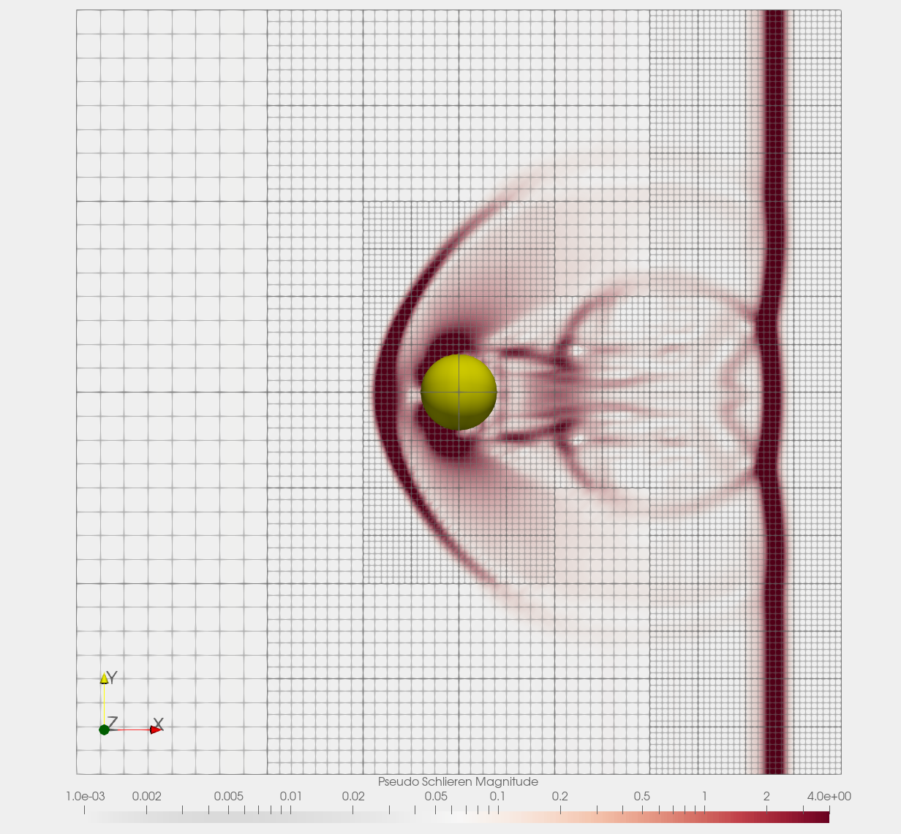

<a name="top"></a>

# Shock-sphere test for NASTO NVF

> Shock-sphere interaction test for ADAM NASTO app, NVF backend.

This test perform a shock-sphere interaction simulation of ADAM NASTO app compiled with NVF backend. The test is configured to run almost quickly
on a single Nvidia GPU.

The test documentation is contained in the following sections:

 | [Copyrights](#copyrights) | [Install](#install) | [Test](#test) |

Go to [Top](#top)

# Copyrights

ADAM is currently a closed project:

> Copyright (C) Di Mascio/Rossi/Salvadore/Zaghi, Inc - All Rights Reserved.
>
> Unauthorized copying of these source files, via any medium is strictly prohibited, proprietary and confidential.
> Written by Andrea di Mascio, Giacomo Rossi, Francesco Salvadore and Stefano Zaghi, September 2023.

Future versions could be released with a more Free Open Source Software (FOSS) licence.

Go to [Top](#top)

# Install

NASTO, like the ADAM framework, is provided as source files archive and it must be compiled in order to have the executable ready to be installed.

To install and compile NASTO NVF app see [its own documentation](../../../../app/nasto/nvf/README.md).

Once NASTO NVF app has been compiled, the test is ready to be exectuted.

Go to [Top](#top)

# Test

The test directory contains the following files:

```bash
┌╼ stefano@enlil
├───╼ ~/fortran/adam/src/tests/nasto/nvf/shock-sphere
└──────╼ tree
.
├── adam_nasto_nvf -> ../../../../../exe/adam_nasto_nvf
├── adam-nasto-shock-sphere.ini
├── check-schlieren.png
├── check-schlieren.pvsm
├── clean.sh
└── run_test.sh
```

+ `adam_nasto_nvf` is a symbolic link to the NASTO NVF app that should be correctly placed if the [install](#install) step has been correctly completed;
+ `adam-nasto-shock-sphere.ini` contains all the configurations data for the simulation;
+ `check-schlieren.png` is a PNG image useful to che the test results;
+ `check-schlieren.pvsm` is a ParaView state file useful to che the test results;
+ `clean.sh` is a bash script to clean the directory before the test if necessary;
+ `run_test.sh` is a bash script to execute the test.

The clean script takes no arguments, it can be executed as
```bash
./clean.sh
```
This clean the test directory without any messages.

The running script can be exectuted without argument as the following:
```bash
./run_test.sh
```
This run the test producing all the simulation status in the standard output as well as saving this information into the `run_test.log` file for easy
reading a posteriori. The run script can be also executed passing one argument to activate the **debug** mode as the following:
```bash
./run_test.sh -debug
```
This run the test by means of `compute-sanitizer` Nvidia app that generate a lot more information if something is going wrong.

After a succesfull test the directory should looks like:
```bash
┌╼ stefano@enlil
├───╼ ~/fortran/adam/src/tests/nasto/nvf/shock-sphere
└──────╼ tree
.
├── adam_nasto_nvf -> ../../../../../exe/adam_nasto_nvf
├── adam-nasto-shock-sphere.ini
├── check-schlieren.pvsm
├── clean.sh
├── run_test.log
├── run_test.sh
├── sphere-shock-000000000-proc000000.h5
├── sphere-shock-000000000.xdmf
├── sphere-shock-000000500-proc000000.h5
├── sphere-shock-000000500.xdmf
├── sphere-shock-000001000-proc000000.h5
├── sphere-shock-000001000.xdmf
├── sphere-shock-000001137-proc000000.h5
├── sphere-shock-000001137.xdmf
├── sphere-shock-restart-proc000000.fbd
├── sphere-shock-restart-proc000000.h5
├── sphere-shock-restart.time
├── sphere-shock-restart.tnd
└── sphere-shock-restart.xdmf
```
The HDF5 output results can be visualized and controlled by means of ParaView using the provided state file `check-schlieren.pvsm`. The results should looks like
in the following image.



Go to [Top](#top)
